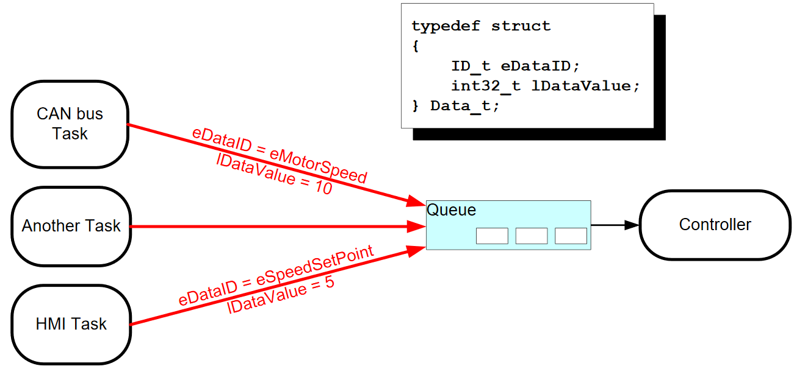
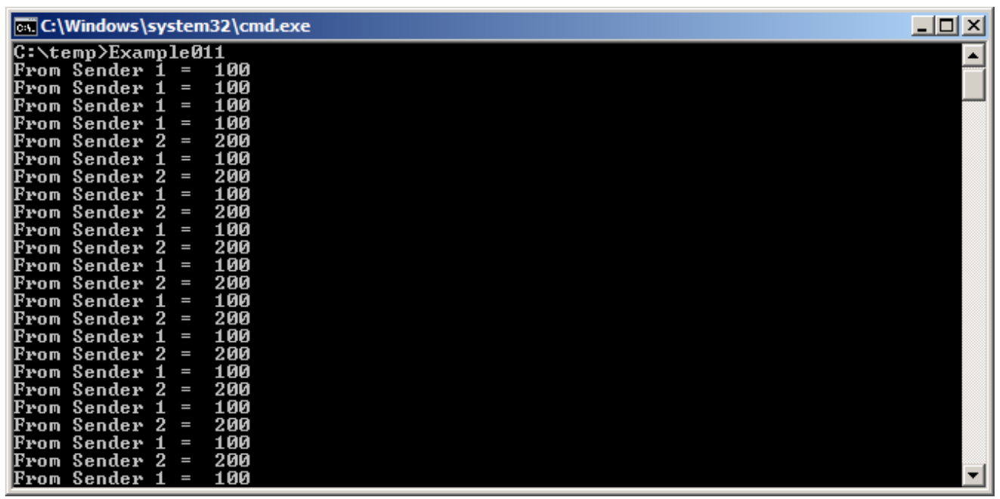

# 队列管理

## 章节介绍与范围

“队列” 提供了一个**任务到任务**，**任务到中断**和**中断到任务**的通讯机制。

### 范围

本章节的目标是告诉读者很好的理解：

* 如何创建队列。
* 一个队列是如何管理它所包含的数据。
* 如何发送数据到队列。
* 如何从队列接收数据。
* 阻塞队列意味着什么。
* 如何阻塞多个队列。
* 如何覆盖队列中的数据。
* 如何清除一个队列。
* 读取和写入一个队列对任务优先级的影响。

本章节只涵盖了任务到任务通讯。任务到中断与中断到任务通讯在第 6 章中说明。

## 队列的特征

### 数据存储

一个队列能保存有限数量的固定大小的数据单元。一个队列能保存单元的最大数量叫做 “长度”。每个队列数据单元的长度与大小是在创建队列时设置的。

队列通常是一个先入先出（FIFO）的缓冲区，即数据在队列末尾（tail）被写入，在队列前部（head）移出。图 31 展示了数据被写入和移出作为 FIFO 使用的队列。也可以写入队列的前端，并覆盖已位于队列前端的数据。


有两种方法可以实现队列的行为：

1. 通过复制实现队列：复制队列是指将发送到队列的数据一个字节一个字节地复制到队列中。
2. 通过引用实现队列：引用队列意味着队列只持有指向发送到队列的数据的指针，而不是数据本身。

FreeRTOS 是通过使用复制方法实现队列。这是考虑到复制队列比引用队列更强大，更容易使用，因为：

* 堆栈变量可以直接发送到队列，即使该变量将在声明它的函数退出后，不再存在。
* 可以将数据发送到队列，而无需先分配缓冲区来保存数据，然后将数据复制到分配的缓冲区中。
* 发送任务可以立即重用发送到队列的变量或缓冲区。
* 发送任务和接收任务是完全解耦的，应用程序设计人员不需要关心哪个任务拥有数据，或者哪个任务负责发布数据。
* 复制队列并不会阻止队列也被用于引用队列。例如，当正在排队的数据的大小使得将数据复制到队列不切实际时，可以将指向数据的指针复制到队列中。
* RTOS 完全负责分配用于存储数据的内存。
* 在受内存保护的系统中，任务可以访问的 RAM 将受到限制。在这种情况下，只有当发送和接收任务都可以访问存储数据的 RAM 时，才可以使用引用排队。按复制排队不受此限制；内核总是以完全特权运行，允许使用队列跨内存保护边界传递数据。

### 多任务访问

队列本身就是对象，任何知道它们存在的任务或 ISR 都可以访问它们。任意数量的任务可以写入同一个队列，任意数量的任务也可以从同一个队列读取。在实践中，队列有多个写入者是非常常见的，但是队列有多个读取者就不那么常见了。

### 阻塞队列读取

当任务尝试从队列中读取时，它可以选择指定 “阻塞” 时间。 如果队列已经为空，则这是任务将保持在阻塞状态以等待队列中的数据可用的时间。 当另一个任务或中断将数据放入队列时，处于阻塞状态且等待数据从队列中变为可用的任务将自动移至就绪状态。 如果指定的阻塞时间在数据可用之前到期，则任务也将自动从 “阻塞” 状态移动到 “就绪” 状态。

队列可以有多个读取者，因此单个队列可能会由多个在其上阻塞等待数据的任务。 在这种情况下，只有一个任务在数据可用时将被解除阻塞。 取消阻塞的任务始终是等待数据的最高优先级任务。 如果被阻塞的任务具有相同的优先级，那么等待数据最长的任务将被阻塞。

### 阻塞队列写入

与从队列读取数据时一样，任务也可以在向队列写入数据时指定阻塞时间。在这种情况下，如果队列已经满了，则阻塞时间是任务应该保持在阻塞状态以等待队列上可用空间的最长时间。

队列可以有多个写入者，因此对于一个完整的队列，可能有多个任务阻塞在队列上，等待完成发送操作。在这种情况下，当队列上的空间可用时，只有一个任务将被解除阻塞。未阻塞的任务总是等待空间的最高优先级任务。如果阻塞的任务具有相同的优先级，那么等待空间最长的任务将被解除阻塞。

### 阻塞多个队列

队列可被分组到集合中，允许任务进入阻塞状态来等待数据在集合的任何队列中变为可用。队列集合在第 4.6 章节 “从多个队列接收” 中展示。

## 使用队列

### xQueueCreate\(\) API 函数

一个队列在使用前必须被显式的创建。

队列被句柄引用，句柄是类型为 `QueueHandle_t` 类型的变量。`xQueueCreate()` API 函数会创建一个队列，并给一个 `QueueHandle_t` 的变量来引用这个被创建的队列。

FreeRTOS V9.0.0 也包含了 `xQueueCreateStatic()` 函数，它创建队列是在编译时静态地分配内存。当一个队列创建时，FreeRTOS 是从 FreeRTOS 堆中分配所需 RAM。这一段 RAM 被用来保存队列数据结构和队列所含的各个单元。`xQueueCreate()` 在创建队列所需 RAM 不足时会返回 `NULL` 。第 2 章提供了 FreeRTOS 堆的更多信息。

```c
QueueHandle_t xQueueCreate( UBaseType_t uxQueueLength, UBaseType_t uxItemSize);
```

清单 40. `xQueueCreate()` API 函数原型

表 18. `xQueueCreate()` 参数和返回值

| 参数名 | 描述 |
| :--- | :--- |
| uxQueueLength | 正在创建的队列一次可以容纳的最大项数。 |
| uxItemSize | 可以存储在队列中的每个数据项的字节大小。 |
| 返回值 | 如果返回 `NULL`，则无法创建队列，因为 FreeRTOS 没有足够的堆内存来分配队列数据结构和存储区域。返回的非空值表示队列已成功创建。返回的值应该存储为已创建队列的句柄。 |

创建队列后，可以使用 `xQueueReset()` API 函数将队列返回到其原始的空状态。

### xQueueSendToBack\(\) 与 xQueueSendToFront\(\) API 函数

正如所料，`xQueueSendToBack()` 用于将数据发送到队列的后端（尾部），`xQueueSendToFront()` 用于将数据发送到队列的前端（头部）。

`xQueueSend()` 与 `xQueueSendToBack()` 等价，并且完全相同。


永远不要从中断服务例程调用 `xQueueSendToFront()` 或 `xQueueSendToBack()`。应该使用中断安全转换 `xQueueSendToFrontFromISR()` 和 `xQueueSendToBackFromISR()` 。这些将在第 6 章中描述。


```c
BaseType_t xQueueSendToFront( QueueHandle_t xQueue,
                              const void * pvItemToQueue,
                              TickType_t xTicksToWait );
```

清单 41. `xQueueSendToFront()` API 函数原型

```c
BaseType_t xQueueSendToBack( QueueHandle_t xQueue,
                             const void * pvItemToQueue,
                             TickType_t xTicksToWait );
```

清单 42. `xQueueSendToBack()` API 函数原型

表 19. `xQueueSendToFront()` 和 `xQueueSendToSendToBack()` 函数参数和返回值

<table>
  <thead>
    <tr>
      <th style="text-align:left">&#x53C2;&#x6570;&#x540D;&#x79F0;/&#x8FD4;&#x56DE;&#x503C;</th>
      <th style="text-align:left">&#x63CF;&#x8FF0;</th>
    </tr>
  </thead>
  <tbody>
    <tr>
      <td style="text-align:left">xQueue</td>
      <td style="text-align:left">&#x53D1;&#x9001;(&#x5199;&#x5165;)&#x6570;&#x636E;&#x7684;&#x961F;&#x5217;&#x7684;&#x53E5;&#x67C4;&#x3002;&#x961F;&#x5217;&#x53E5;&#x67C4;&#x5C06;&#x4ECE;&#x7528;&#x4E8E;&#x521B;&#x5EFA;&#x961F;&#x5217;&#x7684; <code>xQueueCreate()</code> &#x8C03;&#x7528;&#x4E2D;&#x8FD4;&#x56DE;&#x3002;</td>
    </tr>
    <tr>
      <td style="text-align:left">pvItemToQueue</td>
      <td style="text-align:left">
        <p>&#x6307;&#x5411;&#x8981;&#x590D;&#x5236;&#x5230;&#x961F;&#x5217;&#x4E2D;&#x7684;&#x6570;&#x636E;&#x7684;&#x6307;&#x9488;&#x3002;</p>
        <p>&#x5728;&#x521B;&#x5EFA;&#x961F;&#x5217;&#x65F6;&#xFF0C;&#x5C06;&#x8BBE;&#x7F6E;&#x961F;&#x5217;&#x53EF;&#x4EE5;&#x5BB9;&#x7EB3;&#x7684;&#x6BCF;&#x4E2A;&#x9879;&#x76EE;&#x7684;&#x5927;&#x5C0F;&#xFF0C;&#x56E0;&#x6B64;&#x8FD9;&#x591A;&#x4E2A;&#x5B57;&#x8282;&#x5C06;&#x4ECE; <code>pvItemToQueue</code> &#x590D;&#x5236;&#x5230;&#x961F;&#x5217;&#x5B58;&#x50A8;&#x533A;&#x57DF;&#x4E2D;&#x3002;</p>
      </td>
    </tr>
    <tr>
      <td style="text-align:left">xTicksToWait</td>
      <td style="text-align:left">
        <p>&#x5982;&#x679C;&#x961F;&#x5217;&#x5DF2;&#x7ECF;&#x6EE1;&#x4E86;&#xFF0C;&#x4EFB;&#x52A1;&#x5E94;&#x8BE5;&#x4FDD;&#x6301;&#x963B;&#x585E;&#x72B6;&#x6001;&#x4EE5;&#x7B49;&#x5F85;&#x961F;&#x5217;&#x4E0A;&#x53EF;&#x7528;&#x7A7A;&#x95F4;&#x7684;&#x6700;&#x5927;&#x65F6;&#x95F4;&#x91CF;&#x3002;</p>
        <p>&#x5982;&#x679C; <code>xTicksToWait</code> &#x4E3A;&#x96F6;&#x4E14;&#x961F;&#x5217;&#x5DF2;&#x6EE1;&#xFF0C;&#x5219; <code>xQueueSendToFront()</code> &#x548C; <code>xQueueSendToBack()</code> &#x90FD;&#x5C06;&#x7ACB;&#x5373;&#x8FD4;&#x56DE;&#x3002;</p>
        <p>&#x963B;&#x585E;&#x65F6;&#x95F4;&#x4EE5;&#x6EF4;&#x7B54;&#x5468;&#x671F;&#x6307;&#x5B9A;&#xFF0C;&#x56E0;&#x6B64;&#x5B83;&#x6240;&#x8868;&#x793A;&#x7684;&#x7EDD;&#x5BF9;&#x65F6;&#x95F4;&#x4F9D;&#x8D56;&#x4E8E;&#x6EF4;&#x7B54;&#x9891;&#x7387;&#x3002;&#x5B8F; <code>pdMS TO TICKS()</code> &#x53EF;&#x7528;&#x4E8E;&#x5C06;&#x4EE5;&#x6BEB;&#x79D2;&#x4E3A;&#x5355;&#x4F4D;&#x7684;&#x65F6;&#x95F4;&#x8F6C;&#x6362;&#x4E3A;&#x4EE5;&#x8282;&#x62CD;&#x4E3A;&#x5355;&#x4F4D;&#x7684;&#x65F6;&#x95F4;&#x3002;</p>
        <p>&#x5982;&#x679C;&#x5728; <code>FreeRTOSConfig.h</code> &#x4E2D;&#x5C06; <code>INCLUDE_vTaskSuspend</code> &#x8BBE;&#x7F6E;&#x4E3A;
          1&#xFF0C;&#x5219;&#x5C06; <code>xTicksToWait</code> &#x8BBE;&#x7F6E;&#x4E3A; <code>portMAX_DELAY</code> &#x5C06;&#x5BFC;&#x81F4;&#x4EFB;&#x52A1;&#x65E0;&#x9650;&#x671F;&#x5730;&#x7B49;&#x5F85;&#xFF08;&#x6CA1;&#x6709;&#x8D85;&#x65F6;&#xFF09;&#x3002;</p>
      </td>
    </tr>
    <tr>
      <td style="text-align:left">&#x8FD4;&#x56DE;&#x503C;</td>
      <td style="text-align:left">
        <p>&#x6709;&#x4E24;&#x79CD;&#x53EF;&#x80FD;&#x7684;&#x8FD4;&#x56DE;&#x503C;&#xFF1A;</p>
        <ol>
          <li>pdPASS&#xFF1A;&#x4EC5;&#x5F53;&#x6570;&#x636E;&#x6210;&#x529F;&#x53D1;&#x9001;&#x5230;&#x961F;&#x5217;&#x65F6;&#xFF0C;&#x624D;&#x4F1A;&#x8FD4;&#x56DE; <code>pdPASS</code>&#x3002;&#x5982;&#x679C;&#x6307;&#x5B9A;&#x4E86;&#x963B;&#x585E;&#x65F6;&#x95F4;&#xFF08;<code>xTicksToWait</code> &#x4E0D;&#x4E3A;&#x96F6;&#xFF09;&#xFF0C;&#x90A3;&#x4E48;&#x8C03;&#x7528;&#x4EFB;&#x52A1;&#x53EF;&#x80FD;&#x88AB;&#x7F6E;&#x4E8E;Blocked&#x72B6;&#x6001;&#xFF0C;&#x7B49;&#x5F85;&#x7A7A;&#x95F4;&#x5728;&#x961F;&#x5217;&#x4E2D;&#x53D8;&#x4E3A;&#x53EF;&#x7528;&#xFF0C;&#x5728;&#x51FD;&#x6570;&#x8FD4;&#x56DE;&#x4E4B;&#x524D;&#xFF0C;&#x4F46;&#x6570;&#x636E;&#x5DF2;&#x6210;&#x529F;&#x5199;&#x5165;&#x961F;&#x5217;
            &#x5728;&#x963B;&#x6B62;&#x65F6;&#x95F4;&#x5230;&#x671F;&#x4E4B;&#x524D;&#x3002;</li>
          <li>errQUEUE_FULL&#xFF1A;&#x5982;&#x679C;&#x7531;&#x4E8E;&#x961F;&#x5217;&#x5DF2;&#x6EE1;&#xFF0C;&#x65E0;&#x6CD5;&#x5C06;&#x6570;&#x636E;&#x5199;&#x5165;&#x961F;&#x5217;&#xFF0C;&#x5C06;&#x8FD4;&#x56DE;<code>errQUEUE_FULL</code> &#x3002;&#x5982;&#x679C;&#x6307;&#x5B9A;&#x4E86;&#x963B;&#x585E;&#x65F6;&#x95F4;&#xFF08;<code>xTicksToWait</code> &#x4E0D;&#x4E3A;&#x96F6;&#xFF09;&#xFF0C;&#x5219;&#x8C03;&#x7528;&#x4EFB;&#x52A1;&#x5C06;&#x88AB;&#x7F6E;&#x4E8E;&#x963B;&#x585E;&#x72B6;&#x6001;&#x4EE5;&#x7B49;&#x5F85;&#x53E6;&#x4E00;&#x4E2A;&#x4EFB;&#x52A1;&#x6216;&#x4E2D;&#x65AD;&#x5728;&#x961F;&#x5217;&#x4E2D;&#x817E;&#x51FA;&#x7A7A;&#x95F4;&#xFF0C;&#x4F46;&#x6307;&#x5B9A;&#x7684;&#x963B;&#x585E;&#x65F6;&#x95F4;&#x5728;&#x8BE5;&#x72B6;&#x6001;&#x4E4B;&#x524D;&#x5230;&#x671F;&#x3002;</li>
        </ol>
      </td>
    </tr>
  </tbody>
</table>`xQueueReceive()` API 函数

xQueueReceive\(\) 是用来从队列中接收（读取）一个元素。收到的元素将从队列中删除。


切勿从中断服务程序调用 `xQueueReceive()`。 中断安全 `xQueueReceiveFromISR()` API 函数在第 6 章中描述。


```c
BaseType_t xQueueReceive( QueueHandle_t xQueue,
                          void *const pvBuffer,
                          TickType_t xTicksToWait );
```

清单 43. `xQueueReceive()` API 函数原型

表 20. `xQueueReceive()` 函数参数和返回值 

<table>
  <thead>
    <tr>
      <th style="text-align:left">&#x53C2;&#x6570;&#x540D;&#x79F0;/&#x8FD4;&#x56DE;&#x503C;</th>
      <th style="text-align:left">&#x63CF;&#x8FF0;</th>
    </tr>
  </thead>
  <tbody>
    <tr>
      <td style="text-align:left">xQueue</td>
      <td style="text-align:left">
        <p>&#x6B63;&#x5728;&#x63A5;&#x6536;&#xFF08;&#x8BFB;&#x53D6;&#xFF09;&#x6570;&#x636E;&#x7684;&#x961F;&#x5217;&#x53E5;&#x67C4;&#x3002;</p>
        <p>&#x5C06;&#x4ECE;&#x7528;&#x4E8E;&#x521B;&#x5EFA;&#x961F;&#x5217;&#x7684; <code>xQueueCreate()</code> &#x8C03;&#x7528;&#x8FD4;&#x56DE;&#x961F;&#x5217;&#x53E5;&#x67C4;&#x3002;</p>
      </td>
    </tr>
    <tr>
      <td style="text-align:left">pvBuffer</td>
      <td style="text-align:left">
        <p>&#x6307;&#x5411;&#x8981;&#x5C06;&#x63A5;&#x6536;&#x5230;&#x7684;&#x6570;&#x636E;&#x590D;&#x5236;&#x5230;&#x7684;&#x5185;&#x5B58;&#x7684;&#x6307;&#x9488;&#x3002;</p>
        <p>&#x5728;&#x521B;&#x5EFA;&#x961F;&#x5217;&#x65F6;&#x8BBE;&#x7F6E;&#x961F;&#x5217;&#x4FDD;&#x5B58;&#x7684;&#x6BCF;&#x4E2A;&#x6570;&#x636E;&#x9879;&#x7684;&#x5927;&#x5C0F;&#x3002; <code>pvBuffer</code> &#x6307;&#x5411;&#x7684;&#x5185;&#x5B58;&#x5FC5;&#x987B;&#x81F3;&#x5C11;&#x8DB3;&#x4EE5;&#x5BB9;&#x7EB3;&#x90A3;&#x4E48;&#x591A;&#x5B57;&#x8282;&#x3002;</p>
      </td>
    </tr>
    <tr>
      <td style="text-align:left">xTicksToWait</td>
      <td style="text-align:left">
        <p>&#x5982;&#x679C;&#x961F;&#x5217;&#x5DF2;&#x7ECF;&#x4E3A;&#x7A7A;&#xFF0C;&#x5219;&#x4EFB;&#x52A1;&#x5E94;&#x4FDD;&#x6301;&#x5728;&#x963B;&#x585E;&#x72B6;&#x6001;&#x4EE5;&#x7B49;&#x5F85;&#x6570;&#x636E;&#x7684;&#x6700;&#x957F;&#x65F6;&#x95F4;&#x5728;&#x961F;&#x5217;&#x4E2D;&#x53EF;&#x7528;&#x3002;</p>
        <p>&#x5982;&#x679C; <code>xTicksToWait</code> &#x4E3A;&#x96F6;&#xFF0C;&#x90A3;&#x4E48;&#x5982;&#x679C;&#x961F;&#x5217;&#x5DF2;&#x7ECF;&#x4E3A;&#x7A7A;&#xFF0C;&#x5219; <code>xQueueReceive()</code> &#x5C06;&#x7ACB;&#x5373;&#x8FD4;&#x56DE;&#x3002;</p>
        <p>&#x963B;&#x585E;&#x65F6;&#x95F4;&#x5728;&#x6EF4;&#x7B54;&#x5468;&#x671F;&#x4E2D;&#x6307;&#x5B9A;&#xFF0C;&#x56E0;&#x6B64;&#x5B83;&#x8868;&#x793A;&#x7684;&#x7EDD;&#x5BF9;&#x65F6;&#x95F4;&#x53D6;&#x51B3;&#x4E8E;&#x6EF4;&#x7B54;&#x9891;&#x7387;&#x3002;
          &#x5B8F; <code>pdMS_TO_TICKS()</code>&#x53EF;&#x7528;&#x4E8E;&#x5C06;&#x4EE5;&#x6BEB;&#x79D2;&#x4E3A;&#x5355;&#x4F4D;&#x6307;&#x5B9A;&#x7684;&#x65F6;&#x95F4;&#x8F6C;&#x6362;&#x4E3A;&#x523B;&#x5EA6;&#x4E2D;&#x6307;&#x5B9A;&#x7684;&#x65F6;&#x95F4;&#x3002;</p>
        <p>&#x5C06; <code>xTicksToWait</code> &#x8BBE;&#x7F6E;&#x4E3A; <code>portMAX_DELAY</code> &#x4F1A;&#x5BFC;&#x81F4;&#x4EFB;&#x52A1;&#x65E0;&#x9650;&#x671F;&#x5730;&#x7B49;&#x5F85;&#xFF08;&#x6CA1;&#x6709;&#x8D85;&#x65F6;&#xFF09;&#xFF0C;&#x524D;&#x63D0;&#x662F; <code>FreeRTOSConfig.h</code> &#x4E2D;&#x7684; <code>INCLUDE_vTaskSuspend</code> &#x8BBE;&#x7F6E;&#x4E3A;
          1&#x3002;</p>
      </td>
    </tr>
    <tr>
      <td style="text-align:left">&#x8FD4;&#x56DE;&#x503C;</td>
      <td style="text-align:left">
        <p>&#x6709;&#x4E24;&#x79CD;&#x53EF;&#x80FD;&#x7684;&#x8FD4;&#x56DE;&#x503C;&#xFF1A;</p>
        <ol>
          <li>pdPASS&#xFF1A;&#x4EC5;&#x5F53;&#x4ECE;&#x961F;&#x5217;&#x4E2D;&#x6210;&#x529F;&#x8BFB;&#x53D6;&#x6570;&#x636E;&#x65F6;&#x624D;&#x4F1A;&#x8FD4;&#x56DE; <code>pdPASS</code>&#x3002;
            &#x5982;&#x679C;&#x6307;&#x5B9A;&#x4E86;&#x963B;&#x585E;&#x65F6;&#x95F4;&#xFF08;<code>xTicksToWait</code> &#x4E0D;&#x4E3A;&#x96F6;&#xFF09;&#xFF0C;&#x90A3;&#x4E48;&#x8C03;&#x7528;&#x4EFB;&#x52A1;&#x53EF;&#x80FD;&#x88AB;&#x7F6E;&#x4E8E;&#x963B;&#x585E;&#x72B6;&#x6001;&#xFF0C;&#x7B49;&#x5F85;&#x6570;&#x636E;&#x5728;&#x961F;&#x5217;&#x4E2D;&#x53EF;&#x7528;&#xFF0C;&#x4F46;&#x662F;&#x5728;&#x963B;&#x585E;&#x65F6;&#x95F4;&#x5230;&#x671F;&#x4E4B;&#x524D;&#x5DF2;&#x6210;&#x529F;&#x4ECE;&#x961F;&#x5217;&#x4E2D;&#x8BFB;&#x53D6;&#x6570;&#x636E;&#x3002;</li>
          <li>errQUEUE_EMPTY&#xFF1A;&#x5982;&#x679C;&#x7531;&#x4E8E;&#x961F;&#x5217;&#x5DF2;&#x7ECF;&#x4E3A;&#x7A7A;&#x800C;&#x65E0;&#x6CD5;&#x4ECE;&#x961F;&#x5217;&#x4E2D;&#x8BFB;&#x53D6;&#x6570;&#x636E;&#xFF0C;&#x5219;&#x5C06;&#x8FD4;&#x56DE;<code>errQUEUE_EMPTY</code>&#x3002;&#x5982;&#x679C;&#x6307;&#x5B9A;&#x4E86;&#x963B;&#x585E;&#x65F6;&#x95F4;&#xFF08;<code>xTicksToWait</code> &#x4E0D;&#x4E3A;&#x96F6;&#xFF09;&#xFF0C;&#x90A3;&#x4E48;&#x8C03;&#x7528;&#x4EFB;&#x52A1;&#x5C06;&#x88AB;&#x7F6E;&#x4E8E;&#x963B;&#x585E;&#x72B6;&#x6001;&#x4EE5;&#x7B49;&#x5F85;&#x53E6;&#x4E00;&#x4E2A;&#x4EFB;&#x52A1;&#x6216;&#x4E2D;&#x65AD;&#x5C06;&#x6570;&#x636E;&#x53D1;&#x9001;&#x5230;&#x961F;&#x5217;&#xFF0C;&#x4F46;&#x963B;&#x585E;&#x65F6;&#x95F4;&#x5728;&#x8BE5;&#x65F6;&#x95F4;&#x4E4B;&#x524D;&#x5230;&#x671F;&#x3002;</li>
        </ol>
      </td>
    </tr>
  </tbody>
</table>### uxQueueMessagesWaiting\(\) API 函数

`uxQueueMessagesWaiting()` 用于查询当前队列中的项目数。


切勿从中断服务程序调用 `uxQueueMessagesWaiting()`。 应该在其位置使用中断安全 `uxQueueMessagesWaitingFromISR()`。


```c
UBaseType_t uxQueueMessagesWaiting( QueueHandle_t xQueue );
```

清单 44. `uxQueueMessagesWaiting()` API 函数原型

表 21. `uxQueueMessagesWaiting()` 函数参数或返回值

| 参数名称/返回值 | 描述 |
| :--- | :--- |
| xQueue | 正在查询队列的句柄。 将从用于创建队列的 `xQueueCreate()` 调用返回队列句柄。 |
| 返回值 | 正在查询的队列当前持有的项目数。 如果返回零，则队列为空。 |

### 示例 10. 从队列接收时阻塞

此示例演示了正在创建的队列，从多个任务发送到队列的数据以及从队列中接收的数据。 创建队列以保存 `int32_t` 类型的数据项。 发送到队列的任务不指定阻塞时间，从队列接收的任务执行。

发送到队列的任务的优先级低于从队列接收的任务的优先级。 这意味着队列永远不应包含多个项目，因为只要数据被发送到队列，接收任务就会解锁，抢占发送任务，并删除数据 - 再次将队列留空。

清单 45 显示了写入队列的任务的实现。 创建此任务的两个实例，一个将值 100 连续写入队列，另一个将值 200 连续写入同一队列。 任务参数用于将这些值传递到每个任务实例中。

```c
static void vSenderTask( void *pvParameters )
{
int32_t lValueToSend;
BaseType_t xStatus;
    
    /* 创建此任务的两个实例，以便通过任务参数传递发送到队列的值 —— 这样每个实例可以使用不同
    的值。创建队列是为了保存 int32_t 类型的值，因此将参数转换为所需的类型。 */
    lValueToSend = ( int32_t ) pvParameters;
    
    /* 对于大多数任务，这个任务是在一个无限循环中实现的。 */
    for( ;; )
    {
        /* 将值发送到队列。
        
        第一个参数是数据发送到的队列。队列是在调度程序启动之前创建的，因此在此任务开始执行
        之前。
        
        第二个参数是要发送的数据的地址，在本例中是 lValueToSend 的地址。
        
        第三个参数是阻塞时间 —— 如果队列已经满了，任务应该保持在阻塞状态，等待队列上的空间
        可用。在这种情况下，未指定块时间，因为队列永远不应包含多个元素，因此永远不会满。*/
        xStatus = xQueueSendToBack( xQueue, &lValueToSend, 0 );
        
        if( xStatus != pdPASS )
        {
            /* 发送操作无法完成，因为队列已满 —— 这一定是一个错误，因为队列不能包含更多的
            元素 */
            vPrintString( "Could not send to the queue.\r\n" );
        }
    }
}
```

清单 45. 示例 10 中使用的发送任务的实现。

清单 46 显示了从队列接收数据的任务的实现。 接收任务指定块时间为 100 毫秒，因此将进入阻塞状态以等待数据变为可用。 当队列中的数据可用时，它将离开阻塞状态，或者在没有数据可用的情况下，它将离开 100 毫秒。 在此示例中，100 毫秒超时应该永不过期，因为有两个任务连续写入队列。

```c
static void vReceiverTask( void *pvParameters )
{
/* 声明将保存从队列接收的值的变量。 */
int32_t lReceivedValue;
BaseType_t xStatus;
const TickType_t xTicksToWait = pdMS_TO_TICKS( 100 );
    
    /* 此任务也在无限循环中定义。 */
    for( ;; )
    {
        /* 此调用应该始终发现队列为空，因为此任务将立即删除写入队列的任何数据。 */
        if( uxQueueMessagesWaiting( xQueue ) != 0 )
        {
            vPrintString( "Queue should have been empty!\r\n" );
        }
        
        /* 从队列中接收数据。 
        
        第一个参数是接收数据的队列。队列在调度程序启动之前创建，因此在此任务第一次运
        行之前创建。 
        
        第二个参数是将接收到的数据放置到其中的缓冲区。在这种情况下，缓冲区只是具有保存
        接收数据所需大小的变量的地址。
        
        最后一个参数是阻塞时间如果队列已经为空，任务将保持在阻塞状态等待数据可用的最大
        时间量。 */
        xStatus = xQueueReceive( xQueue, &lReceivedValue, xTicksToWait );
        
        if( xStatus == pdPASS )
        {
            /* 从队列中成功接收到数据，打印出接收到的值。 */
            vPrintStringAndNumber( "Received = ", lReceivedValue );
        }
        else
        {
            /* 即使在等待了100ms 之后，也没有从队列接收到数据。这一定是一个错误，因为
            发送任务是免费运行的，并且将不断地写入队列。*/
            vPrintString( "Could not receive from the queue.\r\n" );
        }
    }
}
```

清单 46. 示例 10  接受任务的实现

清单 47 包含 `main()` 函数的定义。 这只是在启动调度程序之前创建队列和三个任务。 创建队列以最多保存五个 `int32_t` 值，即使设置了任务的优先级，使得队列一次也不会包含多个项目。

```c
/* 声明一个类型为 QueueHandle_t 的变量。该变量用于将句柄存储到所有三个任务都访问的队列中。 */
QueueHandle_txQueue;int main( void )
{
    /* 创建队列最多可以容纳5个值，每个值都足够大，可以容纳 int32_t 类型的变量。 */
    xQueue= xQueueCreate( 5, sizeof( int32_t) );if( xQueue != NULL )
    {
        /* 创建将发送到队列的任务的两个实例。任务参数用于传递任务将写入队列的值，因此一个任务
        将持续向队列写入 100，而另一个任务将持续向队列写入 200。这两个任务都在优先级 1 处创
        建。 */
        xTaskCreate( vSenderTask, "Sender1", 1000, ( void * ) 100, 1, NULL );
        xTaskCreate( vSenderTask, "Sender2", 1000, ( void * ) 200, 1, NULL );
        
        /* 创建将从队列中读取的任务。创建任务的优先级为 2，因此高于发送方任务的优先级。 */
        xTaskCreate( vReceiverTask, "Receiver", 1000, NULL, 2, NULL );
        
        /* 启动调度程序，以便创建的任务开始执行。 */
        vTaskStartScheduler();
    }
    else
    {
        /* 无法创建队列。 */
    }
    
    /* 如果一切正常，那么 main() 将永远不会到达这里，因为调度程序现在将运行这些任务。如果
    main() 确实到达这里，那么很可能没有足够的 FreeRTOS 堆内存可用来创建空闲任务。第 2 章
    提供了关于堆内存管理的更多信息。 */
    for( ;; );
}
```

清单 47. 例 10 中 main\(\) 的实现

发送到队列的两个任务都具有相同的优先级。 这导致两个发送任务依次将数据发送到队列。 例 10 中产生的输出如图 32 所示。


图 33 展示了执行的顺序


## 从多个源接收数据

FreeRTOS 设计中常见的任务是从多个源接收数据，所以接收任务需要知道数据来自何处以确定如何处理数据。 一个简单的设计解决方案是使用单个队列来传输具有数据值和结构域中包含的数据源的结构。 该方案如图 34 所示。



图 34 参考：

* 一个以 `Data_t` 结构创建的队列。这个结构成员允许包含数据值和一个枚举类型来指示一个消息发送到队列。
* 中央的 Controller 任务用于执行主系统功能。 这必须对输入和对队列中与其通信的系统状态的更改作出反应。
* 一个 CAN 总线任务用于封装 CAN 总线接口功能。当 CAN 总线任务接收并解码消息时，它将已解码的消息发送到 `Data_t` 结构中的 Controller 任务。 传输结构的 `eDataID` 成员用于让 Controller 任务知道数据是什么 —— 在描述中它是电机速度值。 传输结构的 `lDataValue` 成员用于让 Controller 任务知道实际的电机速度值。
* 人机界面（HMI）任务用于封装所有 HMI 功能。机器操作员可能以多种方式输入命令和查询值，这些方式必须在 HMI 任务中检测和解释。输入新命令时，HMI 任务将命令以一个 `Data_t` 的结构发送到 Controller 任务。传输结构的 `eDataID` 成员用于让 Controller 任务知道数据是什么 —— 在描述中它是一个新的调定点的值。 传递结构的 `lDataValue` 成员用于让 Controller 任务知道实际调定点的值。

### 示例 11. 发送到队列和发送队列结构时的阻塞

示例 11 与示例 10 类似，但任务优先级相反，因此接收任务的优先级低于发送任务。 此外，队列用于传递结构，而不是整数。

清单 48 显示了示例 11 使用的结构的定义。

```c
/* 定义用于标识数据源的枚举类型。 */
typedef enum
{
    eSender1,
    eSender2
} DataSource_t;

/* 定义将在队列上传递的结构类型。 */
typedef struct
{
    uint8_t ucValue;
    DataSource_t eDataSource;
} Data_t;

/* 声明两个将在队列中传递的 Data_t 类型的变量。 */
static const Data_txStructsToSend[ 2 ] = 
{
    { 100, eSender1 }, /* 由 Sender1 使用。 */
    { 200, eSender2 }  /* 由 Sender2 使用。 */
};
```

清单 48. 要在队列上传递的结构的定义，以及由示例使用的两个变量的声明

在示例 10 中，接收任务具有最高优先级，因此队列中永远不会存在多个元素。 这是因为一旦数据被放入队列中，接收任务就会抢占发送任务。 在示例 11 中，发送任务具有更高的优先级，因此队列通常是满的。 这是因为，一旦接收任务从队列中删除了一个项目，它就会被其中一个发送任务抢占，然后立即重新填充队列。 然后，发送任务重新进入阻塞状态，等待空间再次在队列中可用。

清单 49 显示了发送任务的实现。 发送任务指定 100 毫秒的阻塞时间，因此每次队列变满时，它都会进入阻塞状态以等待由可用空间。当队列中有空间可用时，或者没有空间可用的情况下超过 100 毫秒时，它就会离开阻塞状态。在这个例子中，100 毫秒超时应该永不过期，因为接受任务通过从队列中删除元素来不断地腾出空间。

```c
static void vSenderTask( void *pvParameters )
{
BaseType_txStatus;
const TickType_t xTicksToWait = pdMS_TO_TICKS( 100 );
    
    /* 对于大多数任务，这个任务是在一个无限循环中实现的。 */
    for( ;; )
    {
        /* 发送到队列。
        
        第二个参数是正在发送的结构的地址。地址作为任务参数传入，因此直接使用 pvParameters。 
        
        第三个参数是阻塞时间 —— 如果队列已经满了，任务应该保持在阻塞状态，等待队列上的空间可用。
        之所以指定阻塞时间，是因为发送任务的优先级高于接收任务，因此预计队列将满。当两个发送任
        务都处于阻塞状态时，接收任务将从队列中删除元素。 */
        xStatus = xQueueSendToBack( xQueue, pvParameters, xTicksToWait );
        
        if( xStatus != pdPASS )
        {
            /* 即使等待了 100ms，发送操作也无法完成。这一定是一个错误，因为一旦两个发送任务
            都处于阻塞状态，接收任务就应该在队列中留出空间。 */
            vPrintString( "Could not send to the queue.\r\n" );
        }
    }
}
```

清单 49. 示例 11 发送任务的实现

接收任务的优先级最低，所以只有当两个发送任务都处于阻塞状态时，接收任务才会运行。发送任务仅在队列满时才进入阻塞状态，因此接收任务仅在队列满时才会执行。因此，即使没有指定阻塞时间，它也总是期望接收数据。

清单 50 显示了接收任务的实现。

```c
static void vReceiverTask( void *pvParameters )
{
/* 声明将保存从队列接收的值的结构。 */
Data_t xReceivedStructure;
BaseType_t xStatus;

    /* 这个任务也是在一个无限循环中定义的。 */
    for( ;; )
    {
        /* 因为它的优先级最低，所以只有当发送任务处于阻塞状态时，该任务才会运行。发送任务只
        会在队列已满时进入阻塞状态，因此该任务总是期望队列中的项数等于队列长度，本例中为 3。*/
        if( uxQueueMessagesWaiting( xQueue ) != 3 )
        {
            vPrintString( "Queue should have been full!\r\n" );
        }
        
        /* 从队列中接收。
        
        第二个参数是将接收到的数据放置到其中的缓冲区。在这种情况下，缓冲区只是具有容纳接收结
        构所需大小的变量的地址。
        
        最后一个参数是阻塞时间 —— 如果队列已经为空，任务将保持在阻塞状态等待数据可用的最长时
        间。在当前情况下，不需要阻塞时间，因为此任务只在队列满时运行。 */
        xStatus = xQueueReceive( xQueue, &xReceivedStructure, 0 );
        
        if( xStatus == pdPASS )
        {
            /* 从队列中成功接收到数据，打印出接收到的值和值的源。 */
            if( xReceivedStructure.eDataSource== eSender1 )
            {
                vPrintStringAndNumber( "From Sender 1 = ", xReceivedStructure.ucValue );
            }
            else
            {
                vPrintStringAndNumber( "From Sender 2 = ", xReceivedStructure.ucValue );
            }
        }
        else
        {
            /* 队列中没有收到任何东西。这一定是一个错误，因为该任务应该只在队列满时运行。 */
            vPrintString( "Could not receive from the queue.\r\n" );
        }
    }
}
```

清单 50. 示例 11 接收任务的定义

`main()` 仅比前一个示例略有变化。 创建队列以容纳三个 `Data_t` 结构，并且发送和接收任务的优先级相反。 `main()` 的实现如清单 51 所示。

```c
int main( void )
{
    /* 创建队列以容纳最多 3 个 Data_t 类型的结构。 */
    xQueue = xQueueCreate( 3, sizeof( Data_t) );
    
    if( xQueue != NULL )
    {
        /* 创建将写入队列的任务的两个实例。该参数用于传递任务将写入队列的结构，因此一个任务将持
        续向队列发送 xStructsToSend[0]，而另一个任务将持续发送 xStructsToSend[1]。这两个任
        务都是在优先级 2 创建的，优先级高于接收方的优先级。 */
        xTaskCreate( vSenderTask, "Sender1", 1000, &( xStructsToSend[ 0 ] ), 2, NULL);
        xTaskCreate( vSenderTask, "Sender2", 1000, &( xStructsToSend[ 1 ] ), 2, NULL);
        
        /* 创建将从队列中读取的任务。创建任务的优先级为 1，因此低于发送方任务的优先级。 */
        xTaskCreate( vReceiverTask, "Receiver", 1000, NULL, 1, NULL );
        
        /* 启动调度程序，以便创建的任务开始执行。 */
        vTaskStartScheduler();
    }
    else
    {
        /* 无法创建队列。 */
    }
    
    /* 如果一切正常，那么 main() 将永远不会到达这里，因为调度程序现在将运行这些任务。如果 
    main() 确实到达这里，那么很可能没有足够的堆内存来创建空闲任务。第 2 章提供了关于堆内存管
    理的更多信息。 */
    for( ;; );
}
```

清单 51. 示例 11 `main()` 的实现

示例 11 生成的输出如图 35 所示。



图 36 显示了由于发送任务的优先级高于接收任务的优先级而导致的执行顺序。 表 22 提供了对图 36 的进一步说明，并描述了前四个消息是否来自同一任务。


表 22. 图 36 的关键点

<table>
  <thead>
    <tr>
      <th style="text-align:center">&#x65F6;&#x523B;</th>
      <th style="text-align:left">&#x63CF;&#x8FF0;</th>
    </tr>
  </thead>
  <tbody>
    <tr>
      <td style="text-align:center">t1</td>
      <td style="text-align:left">&#x4EFB;&#x52A1;&#x53D1;&#x9001;&#x65B9; 1 &#x6267;&#x884C;&#x5E76;&#x5411;&#x961F;&#x5217;&#x53D1;&#x9001;
        3 &#x4E2A;&#x6570;&#x636E;&#x9879;&#x3002;</td>
    </tr>
    <tr>
      <td style="text-align:center">t2</td>
      <td style="text-align:left">&#x961F;&#x5217;&#x5DF2;&#x6EE1;&#xFF0C;&#x56E0;&#x6B64;&#x53D1;&#x9001;&#x65B9;
        1 &#x8FDB;&#x5165;&#x963B;&#x585E;&#x72B6;&#x6001;&#xFF0C;&#x7B49;&#x5F85;&#x4E0B;&#x4E00;&#x6B21;&#x53D1;&#x9001;&#x5B8C;&#x6210;&#x3002;&#x4EFB;&#x52A1;&#x53D1;&#x9001;&#x65B9;
        2 &#x73B0;&#x5728;&#x662F;&#x80FD;&#x591F;&#x8FD0;&#x884C;&#x7684;&#x6700;&#x9AD8;&#x4F18;&#x5148;&#x7EA7;&#x4EFB;&#x52A1;&#xFF0C;&#x56E0;&#x6B64;&#x8FDB;&#x5165;&#x8FD0;&#x884C;&#x72B6;&#x6001;&#x3002;</td>
    </tr>
    <tr>
      <td style="text-align:center">t3</td>
      <td style="text-align:left">&#x4EFB;&#x52A1;&#x53D1;&#x9001;&#x8005; 2 &#x53D1;&#x73B0;&#x961F;&#x5217;&#x5DF2;&#x7ECF;&#x6EE1;&#x4E86;&#xFF0C;&#x56E0;&#x6B64;&#x8FDB;&#x5165;&#x963B;&#x585E;&#x72B6;&#x6001;&#xFF0C;&#x7B49;&#x5F85;&#x7B2C;&#x4E00;&#x6B21;&#x53D1;&#x9001;&#x5B8C;&#x6210;&#x3002;&#x4EFB;&#x52A1;&#x63A5;&#x6536;&#x8005;&#x73B0;&#x5728;&#x662F;&#x80FD;&#x591F;&#x8FD0;&#x884C;&#x7684;&#x6700;&#x9AD8;&#x4F18;&#x5148;&#x7EA7;&#x4EFB;&#x52A1;&#xFF0C;&#x56E0;&#x6B64;&#x8FDB;&#x5165;&#x8FD0;&#x884C;&#x72B6;&#x6001;&#x3002;</td>
    </tr>
    <tr>
      <td style="text-align:center">t4</td>
      <td style="text-align:left">&#x4F18;&#x5148;&#x7EA7;&#x9AD8;&#x4E8E;&#x63A5;&#x6536;&#x4EFB;&#x52A1;&#x4F18;&#x5148;&#x7EA7;&#x7684;&#x4E24;&#x4E2A;&#x4EFB;&#x52A1;&#x6B63;&#x5728;&#x7B49;&#x5F85;&#x961F;&#x5217;&#x4E2D;&#x7684;&#x7A7A;&#x95F4;&#x53EF;&#x7528;&#xFF0C;&#x4ECE;&#x800C;&#x5BFC;&#x81F4;&#x4EFB;&#x52A1;&#x63A5;&#x6536;&#x8005;&#x5728;&#x4ECE;&#x961F;&#x5217;&#x4E2D;&#x5220;&#x9664;&#x4E00;&#x4E2A;&#x9879;&#x76EE;&#x540E;&#x7ACB;&#x5373;&#x88AB;&#x62A2;&#x5360;&#x3002;
        &#x4EFB;&#x52A1;&#x53D1;&#x9001;&#x8005; 1 &#x548C;&#x53D1;&#x9001;&#x8005;
        2 &#x5177;&#x6709;&#x76F8;&#x540C;&#x7684;&#x4F18;&#x5148;&#x7EA7;&#xFF0C;&#x56E0;&#x6B64;&#x8C03;&#x5EA6;&#x7A0B;&#x5E8F;&#x9009;&#x62E9;&#x7B49;&#x5F85;&#x65F6;&#x95F4;&#x6700;&#x957F;&#x7684;&#x4EFB;&#x52A1;&#x4F5C;&#x4E3A;&#x5C06;&#x8FDB;&#x5165;&#x8FD0;&#x884C;&#x72B6;&#x6001;&#x7684;&#x4EFB;&#x52A1;
        &#x2014;&#x2014; &#x5728;&#x8FD9;&#x79CD;&#x60C5;&#x51B5;&#x4E0B;&#x662F;&#x4EFB;&#x52A1;&#x53D1;&#x9001;&#x8005;
        1&#x3002;</td>
    </tr>
    <tr>
      <td style="text-align:center">t5</td>
      <td style="text-align:left">
        <p>&#x4EFB;&#x52A1;&#x53D1;&#x9001;&#x8005; 1 &#x5C06;&#x53E6;&#x4E00;&#x4E2A;&#x6570;&#x636E;&#x9879;&#x53D1;&#x9001;&#x5230;&#x961F;&#x5217;&#x3002;
          &#x961F;&#x5217;&#x4E2D;&#x53EA;&#x6709;&#x4E00;&#x4E2A;&#x7A7A;&#x95F4;&#xFF0C;&#x56E0;&#x6B64;&#x4EFB;&#x52A1;&#x53D1;&#x9001;&#x8005;
          1 &#x8FDB;&#x5165;&#x963B;&#x585E;&#x72B6;&#x6001;&#x4EE5;&#x7B49;&#x5F85;&#x4E0B;&#x4E00;&#x6B21;&#x53D1;&#x9001;&#x5B8C;&#x6210;&#x3002;
          &#x4EFB;&#x52A1;&#x63A5;&#x6536;&#x5668;&#x518D;&#x6B21;&#x662F;&#x80FD;&#x591F;&#x8FD0;&#x884C;&#x7684;&#x6700;&#x9AD8;&#x4F18;&#x5148;&#x7EA7;&#x4EFB;&#x52A1;&#xFF0C;&#x56E0;&#x6B64;&#x8FDB;&#x5165;&#x8FD0;&#x884C;&#x72B6;&#x6001;&#x3002;</p>
        <p>&#x4EFB;&#x52A1;&#x53D1;&#x9001;&#x8005; 1 &#x73B0;&#x5728;&#x5DF2;&#x5411;&#x961F;&#x5217;&#x53D1;&#x9001;&#x4E86;&#x56DB;&#x4E2A;&#x9879;&#x76EE;&#xFF0C;&#x4EFB;&#x52A1;&#x53D1;&#x9001;&#x8005;
          2 &#x4ECD;&#x5728;&#x7B49;&#x5F85;&#x5C06;&#x5176;&#x7B2C;&#x4E00;&#x4E2A;&#x9879;&#x76EE;&#x53D1;&#x9001;&#x5230;&#x961F;&#x5217;&#x3002;</p>
      </td>
    </tr>
    <tr>
      <td style="text-align:center">t6</td>
      <td style="text-align:left">&#x4F18;&#x5148;&#x7EA7;&#x9AD8;&#x4E8E;&#x63A5;&#x6536;&#x4EFB;&#x52A1;&#x4F18;&#x5148;&#x7EA7;&#x7684;&#x4E24;&#x4E2A;&#x4EFB;&#x52A1;&#x6B63;&#x5728;&#x7B49;&#x5F85;&#x961F;&#x5217;&#x4E2D;&#x7684;&#x7A7A;&#x95F4;&#x53EF;&#x7528;&#xFF0C;&#x56E0;&#x6B64;&#x4EFB;&#x52A1;&#x63A5;&#x6536;&#x8005;&#x4E00;&#x65E6;&#x4ECE;&#x961F;&#x5217;&#x4E2D;&#x5220;&#x9664;&#x4E86;&#x4E00;&#x4E2A;&#x9879;&#x76EE;&#x5C31;&#x4F1A;&#x88AB;&#x62A2;&#x5360;&#x3002;
        &#x6B64;&#x65F6;&#x53D1;&#x9001;&#x8005; 2 &#x7B49;&#x5F85;&#x7684;&#x65F6;&#x95F4;&#x6BD4;&#x53D1;&#x9001;&#x8005;
        1 &#x957F;&#xFF0C;&#x56E0;&#x6B64;&#x53D1;&#x9001;&#x8005; 2 &#x8FDB;&#x5165;&#x8FD0;&#x884C;&#x72B6;&#x6001;&#x3002;</td>
    </tr>
    <tr>
      <td style="text-align:center">t7</td>
      <td style="text-align:left">&#x4EFB;&#x52A1;&#x53D1;&#x9001;&#x8005; 2 &#x5C06;&#x6570;&#x636E;&#x9879;&#x53D1;&#x9001;&#x5230;&#x961F;&#x5217;&#x3002;
        &#x961F;&#x5217;&#x4E2D;&#x53EA;&#x6709;&#x4E00;&#x4E2A;&#x7A7A;&#x683C;&#xFF0C;&#x56E0;&#x6B64;&#x53D1;&#x4EF6;&#x4EBA;
        2 &#x8FDB;&#x5165;&#x963B;&#x6B62;&#x72B6;&#x6001;&#x4EE5;&#x7B49;&#x5F85;&#x4E0B;&#x4E00;&#x6B21;&#x53D1;&#x9001;&#x5B8C;&#x6210;&#x3002;
        &#x53D1;&#x9001;&#x8005; 1 &#x548C;&#x53D1;&#x9001;&#x8005; 2 &#x90FD;&#x5728;&#x7B49;&#x5F85;&#x961F;&#x5217;&#x4E2D;&#x7684;&#x7A7A;&#x95F4;&#x53EF;&#x7528;&#xFF0C;&#x56E0;&#x6B64;&#x4EFB;&#x52A1;&#x63A5;&#x6536;&#x8005;&#x662F;&#x552F;&#x4E00;&#x53EF;&#x4EE5;&#x8FDB;&#x5165;&#x8FD0;&#x884C;&#x72B6;&#x6001;&#x7684;&#x4EFB;&#x52A1;&#x3002;</td>
    </tr>
  </tbody>
</table>## 使用大型或可变大小的数据

### 排队指针

如果存储在队列中的数据大小很大，则最好使用队列将指针传输到数据，而不是将数据本身逐字节地复制到队列中。 传输指针在处理时间和创建队列所需的 RAM 量方面都更有效。 但是，在队列指针时，必须特别注意确保：

1. 指向的 RAM 的所有者是明确定义的。通过指针在任务之间共享内存时，必须确保两个任务不会同时修改内存内容，或采取任何其他可能导致内存内容无效或不一致的操作。 理想情况下，只允许发送任务访问存储器，直到指向存储器的指针已经排队，并且在从队列接收到指针之后，只允许接收任务访问存储器。
2. 指向的 RAM 仍然有效。如果指向的内存是动态分配的，或者是从预先分配的缓冲区池中获取的，则完全一个任务应该负责释放内存。 任务完成后，任何任务都不应尝试访问内存。永远不应该使用指针来访问已在任务堆栈上分配的数据。 堆栈帧更改后，数据无效。

举例来说，清单 52，清单 53 和清单 54 演示了如何使用队列从一个任务向另一个任务发送指向缓冲区的指针：

* 清单 52 创建了一个最多可以容纳 5 个指针的队列。
* 清单 53 分配缓冲区，将字符串写入缓冲区，然后将指向缓冲区的指针发送到队列。
* 清单 54 从队列中接收指向缓冲区的指针，然后将包含在缓冲区中的字符串打印出来。

```c
/* 声明 QueueHandle_t 类型的变量以保存正在创建的队列的句柄。 */
QueueHandle_t xPointerQueue;

/* 创建一个最多可容纳 5 个指针的队列，在本例中为字符指针。 */
xPointerQueue = xQueueCreate( 5, sizeof( char * ) );
```

清单 52. 创建一个包含指针的队列

```c
/* 获取缓冲区的任务，向缓冲区写入一个字符串，然后将缓冲区的地址发送到清单 52 中创建的队列。 */
void vStringSendingTask( void *pvParameters )
{
char *pcStringToSend;
const size_t xMaxStringLength = 50;
BaseType_t xStringNumber = 0;
    
    for( ;; )
    {
        /* 获取至少为 xMaxStringLength 字符大的缓冲区。prvGetBuffer() 的实现没有显示，
        它可能从预先分配的缓冲区池中获取缓冲区，或者只是动态地分配缓冲区。 */
        pcStringToSend = ( char * ) prvGetBuffer( xMaxStringLength );
        
        /* 将字符串写入缓冲区。 */
        snprintf( pcStringToSend, xMaxStringLength, "String number %d\r\n", xStringNumber );
        
        /* 增加计数器，使字符串在此任务的每次迭代中都不同。 */
        xStringNumber++;
        
        /* 将缓冲区的地址发送到清单 52 中创建的队列。缓冲区的地址存储在 pcStringToSend 变量中。*/
        xQueueSend( xPointerQueue,     /* 队列的句柄。 */
                    &pcStringToSend,   /* 指向缓冲区的指针的地址。 */
                    portMAX_DELAY );
    }
}
```

清单 53. 使用队列发送指向缓冲区的指针

```c
/* 从清单 52 中创建的队列中接收缓冲区地址并写入清单 53 中的任务。缓冲区包含一个字符串，
该字符串被打印出来。 */
void vStringReceivingTask( void *pvParameters )
{
char *pcReceivedString;

    for( ;; )
    {
        /* 接收缓冲区的地址。 */
        xQueueReceive( xPointerQueue,     /* 队列的句柄。 */
                       &pcReceivedString, /* 将缓冲区地址存储在 pcReceivedString 中。 */
                       portMAX_DELAY );   
                       
        /* 缓冲区保存一个字符串，将其打印出来。 */
        vPrintString( pcReceivedString );
        
        /* 不再需要缓冲区 —— 释放它以便可以释放或重新使用它。 */
        prvReleaseBuffer( pcReceivedString );
    }
}
```

清单 54. 使用队列接收指向缓冲区的指针

### 使用队列发送不同类型和长度的数据

前面几节已经证明了两个强大的设计模式：发送结构到一个队列，发送指针到一个队列。 组合这两个技术就可以允许一个任务使用一个队列接收来自任何数据源的任何数据类型。  FreeRTOS+TCP TCP/IP 协议栈的实现提供了如何这样实现的实际例子。

在自己的任务中运行的 TCP/IP 协议栈必须处理许多来自不同源的事件。 不同的事件类型与不同类型和长度的数据相关联。 在 TCP/IP 任务之外发生的所有事件都由 `IPStackEvent_t` 类型的结构描述，并发送到队列上的 TCP/IP 任务。 `IPStackEvent_t` 结构如清单 55 所示，`IPStackEvent_t` 结构的 `pvData` 成员是一个指针，可用于直接保存值或指向缓冲区。

```c
/* 在 TCP/IP 堆栈中用于识别事件的枚举类型的子集。 */
typedef enum
{
    eNetworkDownEvent = 0, /* 网络接口已丢失，或者需要（重新）连接。 */
    eNetworkRxEvent,       /* 从网络接收到一个数据包。 */
    eTCPAcceptEvent,       /* 调用 FreeRTOS_accept() 接受或等待新客户端。 */
    
    /* 其他事件类型会显示在此处，但不会显示在此列表中。 */
    
} eIPEvent_t;

/* 描述事件并在队列中发送到TCP/IP任务的结构。 */
typedef struct IP_TASK_COMMANDS
{
    /* 标识事件的枚举类型。请参见上面的 eIPEvent_t 定义。 */
    eIPEvent_t eEventType;
    
    /* 可以保存值或指向缓冲区的通用指针。 */
    void *pvData;
    
} IPStackEvent_t;
```

清单 55. 用于将事件发送到 FreeRTOS+TCP上的 TCP/IP 协议栈任务结构

TCP/IP 事件及其相关数据的示例包括:

* eNetworkRxEvent：数据的分组已经从网络接收到。从网络接收的数据使用类型为 `IPStackEvent_t` 的结构发送到 TCP/IP 任务，该结构的 `eEventType` 成员设置为 `eNetworkRxEvent`，该结构的 `pvData` 成员用于指向包含接收数据的缓冲区。清单 56 显示了一个伪代码示例。
* eTCPAcceptEvent：套接字是接受或等待来自客户端的连接。接受事件是使用 `IPStackEvent_t` 类型的结构从调用 `FreeRTOS_accept()` 的任务发送到 TCP/IP 任务的。该结构的 `eEventType` 成员设置为 `eTCPAcceptEvent`，该结构的 `pvData` 成员设置为接受连接的套接字的句柄。清单 57 显示了一个伪代码示例。
* eNetworkDownEvent：网络需要连接或重新连接。网络中断事件是使用 `IPStackEvent_t` 类型的结构从网络接口发送到 TCP/IP 任务的。该结构的 `eEventType` 成员设置为 `eNetworkDownEvent`。网络关闭事件不与任何数据相关联，因此不使用该结构的 `pvData` 成员。清单 58 显示了一个伪代码示例。

```c
void vSendRxDataToTheTCPTask( NetworkBufferDescriptor_t *pxRxedData )
{
IPStackEvent_t xEventStruct;

    /* 完成 IPStackEvent_t 结构。接收到的数据存储在 pxRxedData。 */
    xEventStruct.eEventType = eNetworkRxEvent;
    xEventStruct.pvData = ( void * ) pxRxedData;
    
    /* 发送 IPStackEvent_t 结构到 TCP/IP 协议栈。 */
    xSendEventStructToIPTask( &xEventStruct );
    
}
```

清单 56. 伪代码，显示如何使用 `IPStackEvent_t` 结构将从网络接收的数据发送到 TCP/IP 任务

```c
void vSendAcceptRequestToTheTCPTask( Socket_t xSocket )
{
IPStackEvent_t xEventStruct;

    /* 完成 IPStackEvent_t 结构。 */
    xEventStruct.eEventType = eTCPAcceptEvent;
    xEventStruct.pvData = ( void * ) xSocket;
    
    /* 发送 IPStackEvent_t 结构以 TCP/IP 任务。*/
    xSendEventStructToIPTask( &xEventStruct );
}
```

清单 57. 伪代码，显示如何使用 `IPStackEvent_t` 结构发送接受到 TCP/IP 任务的连接的套接字句柄

```c
void vSendNetworkDownEventToTheTCPTask(Socket_t xSocket)
{
IPStackEvent_t xEventStruct;

    /* 完成 IPStackEvent_t 结构。 */
    xEventStruct.eEventType = eNetworkDownEvent;
    xEventStruct.pvData = NULL; /* 未使用，但设置为 NULL 保证完整性。 */
    
    /* 发送 IPStackEvent_t 类型的结构体到 TCP/IP 任务。*/
    xSendEventStructToIPTask( &xEventStruct );
}
```

清单 58. 伪代码，显示如何使用 `IPStackEvent_t` 结构向 TCP 发送网络关闭事件

清单 59 中显示了在 TCP/IP 任务中接收和处理这些事件的代码。可以看出，从队列接收的 `IPStackEvent_t`结构的 `eEventType` 成员用于确定如何解释 `pvData` 成员。

```c
IPStackEvent_t xReceivedEvent;

    /* 阻止网络事件队列，直到接收到事件，或者 xNextIPSleep 滴答通过而没有接收到事件。
    如果对 xQueueReceive() 的调用返回是因为超时，而不是因为接收到事件，则将 eEventType 
    设置为 eNoEvent。 */
    xReceivedEvent.eEventType = eNoEvent;
    xQueueReceive( xNetworkEventQueue, &xReceivedEvent, xNextIPSleep );
    
    /* 收到了哪个事件(如果有)？ */
    switch( xReceivedEvent.eEventType )
    {
        case eNetworkDownEvent :
            /* 尝试(重新)建立连接。此事件与任何数据都没有关联。 */
            prvProcessNetworkDownEvent();
            break;
        case eNetworkRxEvent:
            /* 网络接口收到了一个新数据包。指向接收到的数据的指针存储在接收到的 
            IPStackEvent_t 结构的 pvData 成员中。处理接收到的数据。*/
            prvHandleEthernetPacket( ( NetworkBufferDescriptor_t * )( xReceivedEvent.pvData ) );
            break;
        case eTCPAcceptEvent:
            /* 调用了 FreeRTOS_accept() API函数。接受连接的套接字句柄存储在
            接收到的 IPStackEvent_t 结构的 pvData 成员中。 */
            xSocket = ( FreeRTOS_Socket_t * ) ( xReceivedEvent.pvData );
            xTCPCheckNewClient( pxSocket );
            break;
        
        /* 其他事件类型以相同的方式处理，但在此不显示。 */
    }
```

清单 59. 显示如何接收和处理 IPStackEvent\_t 结构的伪代码

## 从多个队列接收

### 队列集

应用程序设计通常需要单个任务来接收不同大小的数据、不同含义的数据以及来自不同来源的数据。上一节演示了如何使用接收结构的单个队列以简洁高效的方式实现这一点。然而，有时应用程序的设计者正在使用限制其设计选择的约束，这就需要对某些数据源使用单独的队列。例如，集成到设计中的第三方代码可能假设存在专用队列。在这种情况下，可以使用 “队列集”。

队列设置允许所有任务从多个队列接收数据，而无需任务依次轮询每个队列以确定哪个队列\(如果有\)包含数据。

与使用接收结构的单个队列实现相同功能的设计相比，使用队列集从多个源接收数据的设计不那么整洁，效率也较低。因此，建议仅在设计约束绝对必要时才使用队列集。

以下部分描述了如何使用由以下人员设置的队列：

1. 创建队列集。
2. 向集合中添加队列。信号量也可以添加到队列集中。信号量将在本书后面描述。
3. 从队列集中读取数据，以确定队列集中哪些队列包含数据。当作为队列集合成员的队列接收数据时，接收队列的句柄被发送到队列集合，当任务调用从队列集合读取的函数时返回。因此，如果从队列集中返回队列句柄，那么句柄引用的队列就知道包含数据，然后任务就可以直接从队列中读取。


如果队列是队列集的成员，那么不要从队列中读取数据，除非队列的句柄已经首先从队列集中读取。


队列集功能是通过在 `FreeRTOSConfig.h` 中将 `configUSE_QUEUE_SETS` 编译时配置常数设置为 1 来启用的。

### xQueueCreateSet\(\) API函数

