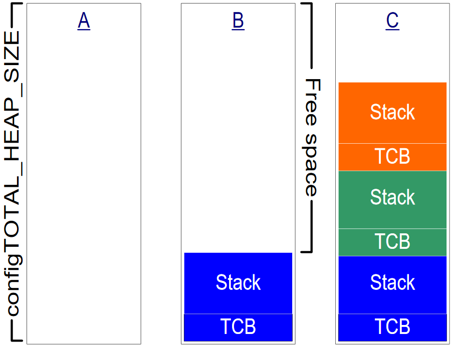
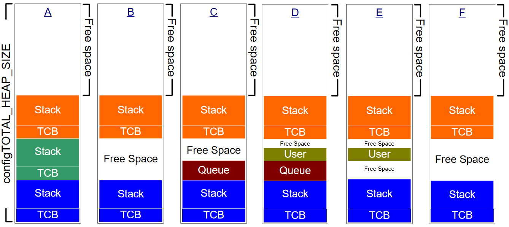
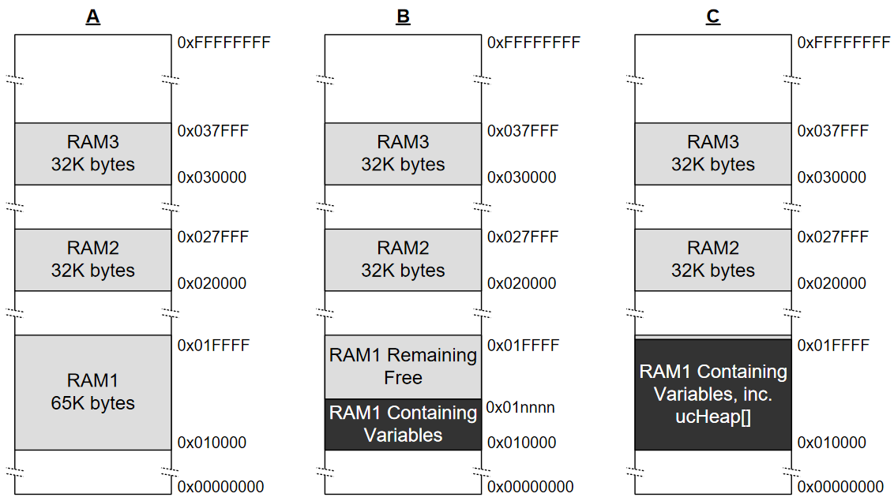

# 堆内存管理

从 FreeRTOS V9.0.0 开始 FreeRTOS 应用程序可以完全静态分配，无需包含堆内存管理器。

## 引言与范围

### 先决条件

FreeRTOS 是作为一组 C 源文件提供的，因此作为一名称职的 C 程序员是使用 FreeRTOS 的先决条件，因此本章假定读者熟悉以下概念：

* 如何构建C项目，包括不同的编译和链接阶段。
* 栈和堆是什么.
* 标准 C 库 `malloc()` 和 `free()` 函数。

### 动态内存分配及其与 FreeRTOS 的相关性

从 FreeRTOS V9.0.0 开始，内核对象可以在编译时静态分配，也可以在运行时动态分配：本书的后续章节将介绍内核对象，如任务，队列，信号量和事件组。 为了使 FreeRTOS 尽可能易于使用，这些内核对象在编译时不是分配的，而是在运行时动态分配的; 每次创建内核对象时，FreeRTOS 都会分配 RAM，并在每次删除内核对象时释放 RAM。 此策略减少了设计和计划工作，简化了 API，并最大限度地减少了 RAM 占用空间。

本章讨论动态内存分配。 动态内存分配是一种 C 编程概念，而不是 FreeRTOS 或多任务特有的概念。 它与 FreeRTOS 相关，因为内核对象是动态分配的，而通用编译器提供的动态内存分配方案并不总是适用于实时应用程序。

可以使用标准 C 库中的 `malloc()` 和 `free()` 函数分配内存，但是由于以下一个或多个原因，它们可能不合适：

* 它们在小型嵌入式系统中并不总是可用。
* 它们的实现可能相对较大，占用了宝贵的代码空间。
* 它们很少是线程安全的。
* 它们不是确定性的; 执行功能所花费的时间因调用而异。
* 它们可能会遭受碎片的折磨。
* 它们会使链接器配置复杂化。
* 如果允许堆空间增长到其他变量使用的内存，它们可能是难以调试出来的错误来源。

### 动态内存分配的选项

从 FreeRTOS V9.0.0 开始，内核对象可以在编译时静态分配，也可以在运行时动态分配：早期版本的FreeRTOS 使用内存池分配方案，从而在编译时预先分配不同大小的内存块池，然后由内存分配功能。 虽然这是在实时系统中使用的常见方案，但它被证明是许多支持请求的来源，主要是因为它无法有效地使用 RAM 以使其适用于非常小的嵌入式系统，因此该方案被放弃。

FreeRTOS 现在将内存分配视为可移植层的一部分（而不是核心代码库的一部分）。 这是因为不同的嵌入式系统具有不同的动态存储器分配和时序要求，因此单个动态存储器分配算法将仅适用于应用的子集。 此外，从核心代码库中删除动态内存分配使应用程序编写者能够在适当时提供自己的特定实现。

当 FreeRTOS 需要 RAM 时，它调用 `pvPortMalloc()`，而不是调用 `malloc()`。 当释放 RAM 时，内核调用 `vPortFree()` 而不是调用 `free()`。 `pvPortMalloc()` 与标准 C 库 `malloc()` 函数具有相同的原型，而 `vPortFree()` 与标准 C 库 `free()` 函数具有相同的原型。

`pvPortMalloc()` 和 `vPortFree()` 是公共函数，因此也可以从应用程序代码中调用它们。

从 FreeRTOS V9.0.0 开始，内核对象可以在编译时静态分配，也可以在运行时动态分配：FreeRTOS 带有`pvPortMalloc()` 和 `vPortFree()` 的五个示例实现，所有这些都在本章中记录。FreeRTOS 应用程序可以使用其中一个示例实现，或提供自己的。

这五个示例分别在 `heap_1.c`，`heap_2.c`，`heap_3.c`，`heap_4.c` 和 `heap_5.c` 源文件中定义，所有这些文件都位于 `FreeRTOS/Source/portable/MemMang` 目录中。

### 范围

本章的目的是让读者更好地理解：

* 什么时候 FreeRTOS 分配RAM。
* FreeRTOS 提供的 5 个内存分配方案示例。
* 选择哪种内存分配方案。

## 内存分配方案示例

从 FreeRTOS V9.0.0 可以完全静态分配 FreeRTOS 应用程序，无需包含堆内存管理器。

### Heap\_1

小型专用嵌入式系统通常只在调度程序启动之前创建任务和其他内核对象。 在这种情况下，内存仅在应用程序开始执行任何实时功能之前由内核动态分配，并且内存在应用程序的生命周期内保持分配。 这意味着所选择的分配方案不必考虑任何更复杂的内存分配问题，例如确定性和分段，而只需考虑代码大小和简单性等属性。

`heap_1.c` 实现了 `pvPortMalloc()` 的一个非常基本的版本，并没有实现 `vPortFree()`。 永远不会删除任务或其他内核对象的应用程序可能会使用 `heap_1`。

一些禁止使用动态内存分配的商业关键系统和安全关键系统也可能使用 `heap_1`。由于与非确定性、内存碎片和失败的分配相关的不确定性，关键系统通常禁止动态内存分配，但是`heap_1`总是确定性的，并且不能分割内存。

`heap_1` 分配方案将一个简单数组细分为更小的块，因为调用了 `pvPortMalloc()` 。 该数组称为FreeRTOS heap。

数组的总大小（以字节为单位）由 `FreeRTOSConfig.h` 中的 `configTOTAL_HEAP_SIZE` 定义设置。 以这种方式定义大型数组可能会使应用程序看起来消耗大量 RAM ，甚至在从数组分配任何内存之前。

每个创建的任务都需要一个任务控制块（TCB）和一个从堆中分配的栈。 图 5 演示了在创建任务时 `heap_1` 如何细分简单数组。

参考图 5：

* A 显示了在创建任何任务之前的数组：整个数组是空闲的。
* B 显示了在创建一个任务之后的数组。
* C 显示了子啊船舰了三个任务之后的数组。



### Heap\_2

`heap_2` 保留在 FreeRTOS 发行版中以实现向后兼容，但不建议将其用于新设计。 考虑使用 `heap_4` 而不是`heap_2`，因为 `heap_4` 提供了增强的功能。

`heap_2.c` 也可以通过细分由 `configTOTAL_HEAP_SIZE` 标注的数组来工作。 它使用最合适的算法来分配内存，与 `heap_1` 不同，它允许释放内存。 同样，数组是静态声明的，因此即使在分配了阵列中的任何内存之前，也会使应用程序看起来消耗大量 RAM。

最合适的算法确保 `pvPortMalloc()` 使用与所请求的字节数最接近的空闲内存块。 例如，考虑场景：

* 堆包含三个可用内存块，分别为 5 个字节，25 个字节和 100 个字节。
* 调用 `pvPortMalloc()` 来请求 20 个字节的 RAM。

所请求的字节数适合的最小空闲 RAM 块是 25 字节块，因此 `pvPortMalloc()` 将 25 字节块拆分为一个 20 字节的块和一个 5 字节的块，然后返回指针 20 字节的块。 新的 5 字节块仍可用于将来调用 `pvPortMalloc()`。

与 `heap_4` 不同，`heap_2` 不会将相邻的空闲块组合成一个更大的块，因此更容易出现碎片。 但是，如果分配并随后释放的块总是大小相同，则碎片不是问题。 `heap_2` 适用于重复创建和删除任务的应用程序，前提是分配给创建的任务的堆栈大小不会更改。


图 6 展示了创建，删除然后再创建任务时最佳拟合算法的工作原理。 参考图6：

1. A 显示了创建了三个任务之后的数组。一个大的自由块仍在数组顶部。
2. B 显示了一个任务被删除之后的数组。数组顶部的大型自由块仍然存在。 现在还有两个较小的空闲块

   ，这是先前已分配给 TCB 和栈的任务，而现在已被删除。

3. C 显示了在创建另一个任务后的情况。 创建任务导致两次调用 `pvPortMalloc()`，一次分配新 TCB，另一次分配任务堆栈。使用 `xTaskCreate()` API 函数创建任务，如 3.4 节所述。 对 `pvPortMalloc()` 的调用在 `xTaskCreate()`内部发生。每个 TCB 的大小完全相同，因此最合适的算法确保先前分配给已删除任务的 TCB 的 RAM 块被重用以分配新任务的 TCB。分配给新创建的任务的堆栈大小与分配给先前删除的相同，因此最合适的算法确保先前分配给已删除任务堆栈的 RAM 块被重用以分配新任务的堆栈。数组顶部较大的未分配块保持不变。

`heap_2` 不是确定性的，但比 `malloc()` 和 `free()` 的大多数标准库实现更快。

### Heap\_3

`heap_3.c` 使用标准库 `malloc()` 和 `free()` 函数，因此堆的大小由链接器配置定义，而 `configTOTAL_HEAP_SIZE` 设置没有影响。`heap_3` 使 `malloc()` 和 `free()` 线程安全暂时挂起 FreeRTOS 调度程序。 线程安全和调度程序暂停都是第 7 章资源管理中介绍的主题。

### Heap\_4

与 `heap_1` 和 `heap_2` 类似，通过将数组细分为较小的块来实现 `heap_4`。 和以前一样，数组是静态声明的，并且由 `configTOTAL_HEAP_SIZE` 标注，因此即使在实际从数组中分配任何内存之前，也会使应用程序看起来消耗大量 RAM。

`heap_4` 使用首次拟合算法来分配内存。 与 `heap_2` 不同，`heap_4` 将相邻的空闲内存块（合并）组合成一个更大的块，从而最大限度地降低了内存碎片的风险。

第一适合算法确保 `pvPortMalloc()`使用足够大的第一个空闲内存块来保存请求的字节数。 例如，考虑以下情况：

* 堆包含三个可用内存块，它们按照它们在数组中出现的顺序分别为 5 个字节，200 个字节和 100 个字节。
* 调用 `pvPortMalloc()` 来请求 20 个字节的 RAM。

请求的字节数适合的第一个RAM块是 200 字节块，因此 `pvPortMalloc()` 将 200 字节块拆分为一个 20 字节的块，以及一个块 180 个字节，然后返回指向 20 的字节块。 新的 180 字节块仍可用于将来调用 `pvPortMalloc()`。

`heap_4` 将相邻空闲块的（合并）组合成一个更大的块，最大限度地降低了碎片的风险，并使其适用于重复分配和释放不同大小的 RAM 块的应用程序。



图 7 演示了如何分配和释放具有内存合并工作的 heap\_4 首次拟合算法。 参考图 7：

1. A 显示了创建三个任务后的数组。 一个大的自由块保留在数组的顶部。
2. B 显示了删除一个任务后的数组。巨大的自由块仍在数组顶部。还有一个空闲块，是先前已分配任务 TCB 和堆栈，现在已经删除。 请注意，与演示 heap\_2 时不同，删除 TCB 时释放的内存以及删除堆栈时释放的内存不会保留为两个单独的空闲块，而是组合起来创建一个更大的单个空闲块。
3. C 显示创建 FreeRTOS 队列后的情况。 队列是使用 `xQueueCreate()` API 函数创建的，该函数在 4.3 节中描述。 `xQueueCreate()` 调用 `pvPortMalloc()` 来分配队列使用的 RAM。 由于 `heap_4` 使用第一适合算法，`pvPortMalloc()` 将从第一个空闲 RAM 块中分配 RAM，该块足够大以容纳队列，如图 7 所示，当任务被删除时，RAM 被释放。队列不会全部消耗然而，空闲块中的 RAM，因此块被分成两部分，未使用的部分仍然可用于将来调用 `pvPortMalloc()`。
4. D 显示了直接从应用程序代码调用 `pvPortMalloc()` 之后的情况，而不是通过 FreeRTOS API 函数的间接调用。 用户分配的块足够小，可以放入第一个空闲块，即分配给队列的内存和分配给后续 TCB 的内存之间的块。 删除任务时释放的内存现在已分成三个独立的块; 第一个块保存队列，第二个块保存用户分配的内存，第三个块保持空闲。
5. E 显示队列被删除后的情况，这会自动释放已分配给已删除队列的内存。现在，用户分配块的任一侧都有可用内存。
6. F 显示用户分配的内存已被释放后的情况。用户分配的块使用的内存已与任意一侧的空闲内存组合，创建一个更大的单个空闲块。

`heap_4` 不是确定性的，但比 `malloc()` 和 `free()` 的大多数标准库实现更快。

### 设置 Heap\_4 使用的数组的起始地址

本节包含高级信息。若只是为了使用 `heap_4`，没有必要阅读或理解本节。

有时，应用程序编写者需要将 `heap_4` 使用的数组放在特定的内存地址。例如，FreeRTOS 任务使用的堆栈是从堆中分配的，因此可能需要确保堆位于快速的内部存储器中， 而不是缓慢的外部存储器。

默认情况下，`heap_4` 使用的数组在 `heap_4.c` 源文件中声明，其起始地址由链接器自动设置。 但是，如果在 `FreeRTOSConfig.h` 中将 `configAPPLICATION_ALLOCATED_HEAP` 编译时配置常量设置为 1，则必须由使用 FreeRTOS 的应用程序声明该数组。 如果数组声明为应用程序的一部分，则应用程序的编写者可以设置其起始地址。

如果在 `FreeRTOSConfig.h` 中将 `configAPPLICATION_ALLOCATED_HEAP` 设置为 1，则必须在其中一个应用程序的源文件中声明一个名为 `ucHeap` 的 `uint8_t` 数组，其大小为 `configTOTAL_HEAP_SIZE` 设置。

将变量放在特定内存地址所需的语法取决于所使用的编译器，因此请参阅编译器的文档。 两个编译器的示例如下：

* 清单 2 显示 GCC 编译器声明数组所需的语法，并将数组放在名为 `.my_heap` 的内存部分中。
* 清单 3 显示 IAR 编译器声明数组所需的语法，并将数组放在绝对地址 `0x20000000` 上 。

```c
uint8_t ucHeap[ configTOTAL_HEAP_SIZE ] __attribute__ ( ( section( ".my_heap" ) ) );
```

清单 2. 使用 GCC 语法声明 `heap_4` 使用的数组，并将数组放在名为 `.my_heap` 的内存段中

```c
uint8_t ucHeap[ configTOTAL_HEAP_SIZE ] @ 0x20000000;
```

清单 3. 使用 IAR 语法声明 `heap_4` 将使用的数组，并将数组放在绝对地址 0x20000000。

### Heap\_5

`heap_5` 用于分配和释放内存的算法与 `heap_4` 使用的算法相同。 与 `heap_4` 不同的是，`heap_5` 不限于从单个静态声明的数组中分配内存; `heap_5` 可以从多个独立的内存空间分配内存。 当运行 FreeRTOS 的系统提供的 RAM 在系统的内存映射中不显示为单个连续（无空间）块时，`heap_5` 非常有用。

在编写本文时，`heap_5` 是唯一提供的内存分配方案，必须在调用 `pvPortMalloc()` 之前显式初始化。 使用 `vPortDefineHeapRegions()` API函数初始化 `Heap_5`。 当使用 `heap_5` 时，必须先调用 `vPortDefineHeapRegions()`，然后才能创建任何内核对象（任务，队列，信号量等）。

### vPortDefineHeapRegions\(\) API函数

`vPortDefineHeapRegions()` 用于指定每个单独的内存区域的起始地址和大小，它们共同构成 `heap_5` 使用的总内存。

```c
void vPortDefineHeapRegions( const HeapRegion_t * const pxHeapRegions );
```

清单 4. `vPortDefineHeapRegions()` API 函数原型

每个单独的存储区域由 `HeapRegion_t` 类型的结构描述。 所有可用内存区域的描述都作为 `HeapRegion_t` 结构数组传递给 `vPortDefineHeapRegions()`。

```c
typedef struct HeapRegion
{
    /* The start address of a block of memory that will be part of the heap.*/
    uint8_t *pucStartAddress;

    /* The size of the block of memoryin bytes. */
    size_t xSizeInBytes;
} HeapRegion_t;
```

清单 5. `HeapRegion_t` 结构

表 5. `vPortDefineHeapRegions()` 参数

| 参数名称/返回值 | 描述 |
| :--- | :--- |


<table>
  <thead>
    <tr>
      <th style="text-align:left">pxHeapRegions</th>
      <th style="text-align:left">
        <p>&#x6307;&#x5411; <code>HeapRegion_t</code> &#x7ED3;&#x6784;&#x6570;&#x7EC4;&#x5F00;&#x5934;&#x7684;&#x6307;&#x9488;&#x3002;
          &#x6570;&#x7EC4;&#x4E2D;&#x7684;&#x6BCF;&#x4E2A;&#x7ED3;&#x6784;&#x90FD;&#x63CF;&#x8FF0;&#x4E86;&#x4F7F;&#x7528; <code>heap_5</code> &#x65F6;&#x5C06;&#x6210;&#x4E3A;&#x5806;&#x7684;&#x4E00;&#x90E8;&#x5206;&#x7684;&#x5185;&#x5B58;&#x533A;&#x57DF;&#x7684;&#x8D77;&#x59CB;&#x5730;&#x5740;&#x548C;&#x957F;&#x5EA6;&#x3002;</p>
        <p>&#x6570;&#x7EC4;&#x4E2D;&#x7684; <code>HeapRegion_t</code> &#x7ED3;&#x6784;&#x5FC5;&#x987B;&#x6309;&#x8D77;&#x59CB;&#x5730;&#x5740;&#x6392;&#x5E8F;;
          &#x63CF;&#x8FF0;&#x5177;&#x6709;&#x6700;&#x4F4E;&#x8D77;&#x59CB;&#x5730;&#x5740;&#x7684;&#x5B58;&#x50A8;&#x533A;&#x57DF;&#x7684; <code>HeapRegion_t</code> &#x7ED3;&#x6784;&#x5FC5;&#x987B;&#x662F;&#x6570;&#x7EC4;&#x4E2D;&#x7684;&#x7B2C;&#x4E00;&#x4E2A;&#x7ED3;&#x6784;&#xFF0C;&#x5E76;&#x4E14;&#x63CF;&#x8FF0;&#x5177;&#x6709;&#x6700;&#x9AD8;&#x8D77;&#x59CB;&#x5730;&#x5740;&#x7684;&#x5B58;&#x50A8;&#x533A;&#x57DF;&#x7684; <code>HeapRegion_t</code> &#x7ED3;&#x6784;&#x5FC5;&#x987B;&#x662F;&#x6570;&#x7EC4;&#x4E2D;&#x7684;&#x6700;&#x540E;&#x4E00;&#x4E2A;&#x7ED3;&#x6784;&#x3002;</p>
        <p>&#x6570;&#x7EC4;&#x7684;&#x672B;&#x5C3E;&#x7531; <code>HeapRegion_t</code> &#x7ED3;&#x6784;&#x6807;&#x8BB0;&#xFF0C;&#x8BE5;&#x7ED3;&#x6784;&#x7684; <code>pucStartAddress</code> &#x6210;&#x5458;&#x8BBE;&#x7F6E;&#x4E3A; <code>NULL</code>&#x3002;</p>
      </th>
    </tr>
  </thead>
  <tbody></tbody>
</table>



清单 6 显示了一个 `HeapRegion_t` 结构数组，它们共同描述了三个 RAM 块。

```c
/* 定义三个RAM区域的起始地址和大小。 */
#define RAM1_START_ADDRESS( ( uint8_t * ) 0x00010000 )
#define RAM1_SIZE( 65 * 1024 )

#define RAM2_START_ADDRESS( ( uint8_t * ) 0x00020000 )
#define RAM2_SIZE( 32 * 1024 )

#define RAM3_START_ADDRESS( ( uint8_t * ) 0x00030000 )
#define RAM3_SIZE( 32 * 1024 )

/* 创建一个 HeapRegion_t 定义数组，其中包含三个 RAM 区域的每个索引，并用空地址结束数组。
HeapRegion_t 结构必须按开始地址顺序出现，包含最低开始地址的结构首先出现。*/
const HeapRegion_t xHeapRegions[] =
{
    { RAM1_START_ADDRESS, RAM1_SIZE },
    { RAM2_START_ADDRESS, RAM2_SIZE },
    { RAM3_START_ADDRESS, RAM3_SIZE },
    { NULL,               0         }  /* 标记数组的结尾。 */
};

int main( void )
{
    /* 初始化 heap_5。 */
    vPortDefineHeapRegions( xHeapRegions );

    /* 在这里添加应用代码。 */
}
```

清单 6. 一个 `HeapRegion_t` 结构数组，它们共同描述了 RAM 的 3 个区域

虽然清单 6 正确描述了 RAM，但它没有演示一个可用的示例，因为它将所有 RAM 分配给堆，而没有 RAM 可供其他变量使用。

构建项目时，构建过程的链接阶段会为每个变量分配一个 RAM 地址。 可供链接器使用的 RAM 通常由链接器配置文件（如链接描述文件）描述。 在图 8 B 中，假设链接器脚本包含有关 RAM1 的信息，但不包括有关 RAM2 或 RAM3 的信息。 因此，链接器在 RAM1 中放置了变量，只留下了地址为 `0x0001nnnn` 的 RAM1 部分可供 heap\_5 使用。 `0x0001nnnn` 的实际值将取决于所链接的应用程序中包含的所有变量的总大小。 链接器使所有 RAM2 和所有 RAM3 都未使用，使得整个 RAM2 和整个 RAM3 可供 `heap_5` 使用。

如果使用清单 6 中所示的代码，则分配给地址 `0x0001nnnn`下面的 `heap_5` 的 RAM 将与用于保存变量的 RAM 重叠。 为避免这种情况，`xHeapRegions[]` 数组中的第一个 `HeapRegion_t` 结构可以使用起始地址`0x0001nnnn`，而不是起始地址 `0x00010000`。 但是，这不是推荐的解决方案，因为：

1. 起始地址可能不容易确定。
2. 链接器使用的 RAM 量可能会在将来的版本中发生变化，需要更新 `HeapRegion_t`结构中使用的起始地址。
3. 构建工具未知， 因此，如果链接器使用的 RAM 和 `heap_5` 使用的 RAM 重叠，则无法警告应用程序编写者。

清单 7 演示了一个更方便和可维护的示例。 它声明了一个名为 `ucHeap` 的数组。 `ucHeap` 是一个普通变量，因此它成为链接器分配给 RAM1 的数据的一部分。 `xHeapRegions` 数组中的第一个 `HeapRegion_t` 结构描述了 `ucHeap` 的起始地址和大小，因此 `ucHeap` 成为 `heap_5` 管理的内存的一部分。 可以增加`ucHeap` 的大小，直到链接器使用的 RAM 消耗所有 RAM1，如图 8 C 所示。

```c
/* 定义链接器未使用的两个RAM区域的起始地址和大小。 */
#define RAM2_START_ADDRESS( ( uint8_t * ) 0x00020000 )
#define RAM2_SIZE( 32 * 1024 )

#define RAM3_START_ADDRESS( ( uint8_t * ) 0x00030000 )
#define RAM3_SIZE( 32 * 1024 )

/* 声明一个数组，该数组将成为 heap_5 使用的堆的一部分。 该数组将由链接器放置在 RAM1 中。 */
#define RAM1_HEAP_SIZE ( 30 * 1024 )
static uint8_t ucHeap[ RAM1_HEAP_SIZE ];

/* 创建一个 HeapRegion_t 数组。 而在清单 6 中，第一个条目描述了所有 RAM1，因此 heap_5 
将使用所有 RAM1，这次第一个条目仅描述 ucHeap 数组，因此 heap_5 将仅使用包含 ucHeap 
数组的 RAM1 部分。 HeapRegion_t 结构仍必须以起始地址顺序出现，其结构包含最先出现的最低起
始地址。*/
const HeapRegion_t xHeapRegions[] =
{
    { ucHeap,             RAM1_HEAP_SIZE },
    { RAM2_START_ADDRESS, RAM2_SIZE },
    { RAM3_START_ADDRESS, RAM3_SIZE },
    { NULL,               0         }  /* 标记数组的结尾。 */
};
```

清单 7. 一个 `HeapRegion_t` 结构数组，描述所有 RAM2，所有 RAM3，但只是 RAM1 的一部分

清单7中演示的技术的优点包括：

1. 没有必要使用硬编码的起始地址。
2. `HeapRegion_t` 结构中使用的地址将由链接器自动设置，因此即使链接器使用的 RAM 量在将来的构建中发生更改，也始终是正确的。
3. 分配给 `heap_5` 的 RAM 不可能与链接器放入 RAM1 的数据重叠。
4. 如果 `ucHeap` 太大，应用程序将不会链接。

## 堆相关的实用功能

### xPortGetFreeHeapSize\(\) API函数

`xPortGetFreeHeapSize()` API 函数在调用函数时返回堆中的空闲字节数。它可用于优化堆大小。 例如，如果 `xPortGetFreeHeapSize()` 在创建了所有内核对象后返回 2000，那么 `configTOTAL_HEAP_SIZE` 的值可以减少 2000。

使用 `heap_3` 时，`xPortGetFreeHeapSize()`不可用。

```c
size_t xPortGetFreeHeapSize( void );
```

清单 8. `xPortGetFreeHeapSize()`API 函数原型

表 6. `xPortGetFreeHeapSize()` 返回值

| 参数名称/返回值 | 描述 |
| :--- | :--- |
| 返回值 | 调用 `xPortGetFreeHeapSize()` 时在堆中保持未分配的字节数。 |

### xPortGetMinimumEverFreeHeapSize\(\) API函数

`xPortGetMinimumEverFreeHeapSize()` API 函数返回自 FreeRTOS 应用程序开始执行以来堆中曾存在的最小未分配字节数。

`xPortGetMinimumEverFreeHeapSize()` 返回的值表明应用程序已经接近耗尽堆空间。例如，如果 `xPortGetMinimumEverFreeHeapSize()` 返回200，那么，在应用程序开始执行后的某个时候，它会在耗尽堆空间的 200 字节之内。

`xPortGetMinimumEverFreeHeapSize()` 仅在使用 `heap_4` 或 `heap_5` 时可用。

```c
size_t xPortGetMinimumEverFreeHeapSize( void );
```

清单 9. `xPortGetMinimumEverFreeHeapSize()`API 函数原型

表 7. `xPortGetMinimumEverFreeHeapSize()`返回值

| 参数名称/返回值 | 描述 |
| :--- | :--- |
| 返回值 | 自 FreeRTOS 应用程序开始执行以来堆中已存在的最小未分配字节数。 |

### malloc 失败的钩子函数

可以直接从应用程序代码调用 `pvPortMalloc()`。 每次创建内核对象时，它也会在 FreeRTOS 源文件中调用。内核对象的示例包括任务，队列，信号量和事件组，所有这些都将在本书后面的章节中介绍。

就像标准库 `malloc()` 函数一样，如果 `pvPortMalloc()` 由于所请求大小的块不存在而无法返回 RAM 块，那么它将返回 `NULL`。 如果由于应用程序编写器正在创建一个内核对象而执行 `pvPortMalloc()`，并且对 `pvPortMalloc()` 的调用返回 `NULL`，则内核对象不会被创建。

如果对 `pvPortMalloc()` 的调用返回 `NULL`，则可以将所有示例堆配置方案配置为调用钩子（或回调）函数。

如果在 `FreeRTOSConfig.h` 中将 `configUSE_MALLOC_FAILED_HOOK` 设置为 1，则应用程序必须提供 malloc 失败的钩子函数，该函数具有由清单 10 显示的名称和原型。该函数可以以适合应用程序的任何方式实现。

```c
void vApplicationMallocFailedHook( void );
```

清单 10. malloc 失败的钩子函数名和原型。

