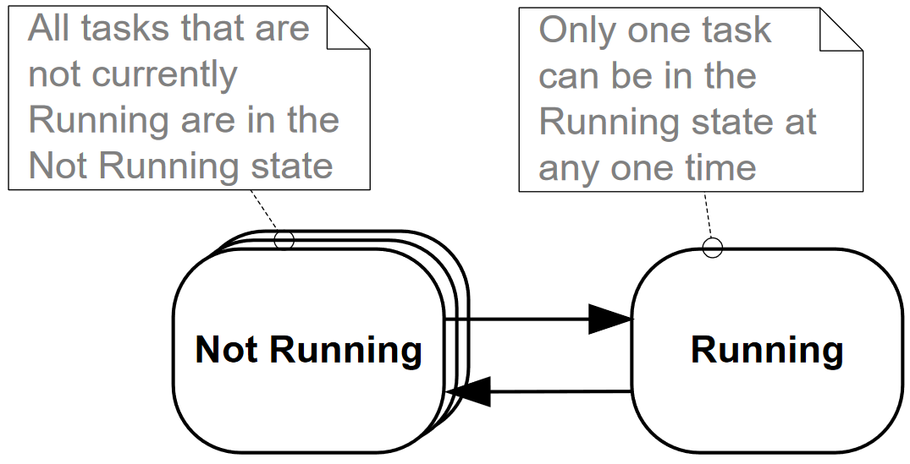

# 任务管理

## 引言与范围

### 范围

本章旨在让读者更好地理解：

* FreeRTOS 如何为应用程序中的每个任务分配处理时间。
* FreeRTOS 如何选择在任何给定时间执行哪个任务。
* 每个任务的相对优先级如何影响系统行为。 
* 任何可以存在的任务。

读者也应该很好地理解：

* 如何实现任务。
* 如何创建一个或多个任务实例。
* 如何使用任务参数。
* 如何更改已被创建任务的优先级。
* 如何删除任务。
* 如何使用任务实现定期处理（软件计时器将在后面的章节中讨论）。
* 空闲任务何时执行以及如何使用。

本章介绍的概念对于理解如何使用 FreeRTOS 以及 FreeRTOS 应用程序的行为至关重要。因此，这是书中最详细的一章。

## 任务函数

任务为 C 函数实现。 它们唯一的特殊之处是它们的原型，它必须返回 `void` 并接受一个 `void` 指针参数。 清单 11 展示了原型。

```c
void ATaskFunction( void *pvParameters );
```

清单 11. 任务函数原型

每个任务本身都是一个小程序。 它有一个入口点，通常会在无限循环内永远运行，并且不会退出。 清单 12中显示了典型任务的结构。

FreeRTOS 任务不允许以任何方式从其实现的函数返回，即它们不能包含 `return` 语句，并且不能允许在函数结束之后执行。 如果不再需要任务，则应明确删除该任务。 这在清单 12 中也有说明。

单个任务函数，可被创建成任意数量的任务，每个创建的任务都是一个单独的执行实例，具有自己的堆栈以及在任务本身内定义的任何自动（堆栈）变量，都有自己的副本。

```c
void ATaskFunction( void *pvParameters )
{
/* 变量可以像普通函数一样声明。使用这个示例函数创建的任务的每个实例都有自己的 lVariableExample 
变量副本。如果将变量声明为静态，则不会出现这种情况，在这种情况下，只有一个变量副本存在，并且该副本
将由任务的每个创建实例共享。(添加到变量名的前缀在第1.5节“数据类型和编码风格指南”中进行了描述。) */
int32_t lVariableExample = 0;

    /* 任务通常将实现为无限循环。 */
    for( ;; )
    {
        /* 实现任务功能的代码将在此处。 */
    }
    
    /* 如果任务实现突破上述循环，则必须在到达其实现功能结束之前删除该任务。 传递给 vTaskDelete() 
    API 函数的 NULL 参数指示要删除的任务是调用（这个）任务。 用于命名 API 函数的约定在第 0 节中
    描述，使用早于 V9.0.0 的 FreeRTOS 版本的项目必须构建一个 heap_n.c 文件。 从 
    FreeRTOS V9.0.0 开始，只有在 FreeRTOSConfig.h 中将 configSUPPORT_DYNAMIC_ALLOCATION
    设置为 1 或者未定义 configSUPPORT_DYNAMIC_ALLOCATION 时才需要 heap_n.c 文件。 有关更多
    信息，请参阅第 2 章堆内存管理。 数据类型和编码风格指南。 */
    vTaskDelete( NULL );
}
```

清单 12. 典型任务函数的结构

## 顶层任务状态

应用程序可以包含许多任务。 如果运行应用程序的处理器是单核的，那么在任何给定时间只能执行一个任务。 这意味着任务可以存在两种状态：运行和未运行。 首先考虑这种简单化的模型，但请记住，这是一种过度简化。 在本章的后面，显示 “未运行” 状态实际上包含许多子状态。

当任务处于运行状态时，则处理器正在执行该任务的代码。 当任务处于 “未运行” 状态时，任务处于休眠状态，其状态已准备好，以便在下次调度程序确定应进入 “运行” 状态时继续执行。 当一个任务恢复执行时，它会从它上次离开运行状态之前执行的指令执行。



从 “未运行” 状态转换为 “运行” 状态的任务被称为 “已切入” 或 “已换入”。 相反，从 “运行” 状态转换到 “未运行” 状态的任务据说已被 “切出” 或 “换出”。 FreeRTOS 的调度程序是唯一可以切换任务的实体。

## 创建任务

### xTaskCreate\(\) API 函数

FreeRTOS V9.0.0 还包含 `xTaskCreateStatic()` 函数，它分配了在编译时静态创建任务所需的内存：任务是使用 FreeRTOS `xTaskCreate()` API 函数创建的。这可能是所有 API 函数中最复杂的一个，因此很不幸，它是第一个遇到的函数，但是必须首先掌握任务，因为它们是多任务系统中最基本的组件。本书附带的所有示例都使用了 `xTaskCreate()` 函数，因此有很多示例可供参考。

第 1.5 节 “数据类型和编程样式指南” 描述了所使用的数据类型和命名约定。

```c
BaseType_t xTaskCreate( TaskFunction_t pvTaskCode, 
                        const char* const pcName, 
                        uint16_t usStackDepth, 
                        void *pvParameters, 
                        UBaseType_t uxPriority, 
                        TaskHandle_t *pxCreatedTask );
```

清单 13. `xTaskCreate()` API 函数原型

表8. `xTaskCreate()` 参数和返回值

<table>
  <thead>
    <tr>
      <th style="text-align:left">&#x53C2;&#x6570;&#x540D;&#x79F0;/&#x8FD4;&#x56DE;&#x503C;</th>
      <th style="text-align:left">&#x63CF;&#x8FF0;</th>
    </tr>
  </thead>
  <tbody>
    <tr>
      <td style="text-align:left">pvTaskCode</td>
      <td style="text-align:left">&#x4EFB;&#x52A1;&#x662F;&#x7B80;&#x5355;&#x7684;C&#x51FD;&#x6570;&#xFF0C;&#x5B83;&#x6C38;&#x8FDC;&#x4E0D;&#x4F1A;&#x9000;&#x51FA;&#xFF0C;&#x56E0;&#x6B64;&#x901A;&#x5E38;&#x88AB;&#x5B9E;&#x73B0;&#x4E3A;&#x65E0;&#x9650;&#x5FAA;&#x73AF;&#x3002; <code>pvTaskCode</code> &#x53C2;&#x6570;&#x53EA;&#x662F;&#x6307;&#x5411;&#x5B9E;&#x73B0;&#x4EFB;&#x52A1;&#x7684;&#x51FD;&#x6570;&#x7684;&#x6307;&#x9488;&#xFF08;&#x5B9E;&#x9645;&#x4E0A;&#xFF0C;&#x53EA;&#x662F;&#x51FD;&#x6570;&#x7684;&#x540D;&#x79F0;&#xFF09;&#x3002;</td>
    </tr>
    <tr>
      <td style="text-align:left">pcName</td>
      <td style="text-align:left">
        <p>&#x4EFB;&#x52A1;&#x7684;&#x63CF;&#x8FF0;&#x6027;&#x540D;&#x79F0;&#x3002;
          FreeRTOS &#x4E0D;&#x4EE5;&#x4EFB;&#x4F55;&#x65B9;&#x5F0F;&#x4F7F;&#x7528;&#x5B83;&#x3002;
          &#x5B83;&#x4EC5;&#x4F5C;&#x4E3A;&#x8C03;&#x8BD5; ID &#x5305;&#x542B;&#x5728;&#x5185;&#x3002;
          &#x901A;&#x8FC7;&#x4EBA;&#x7C7B;&#x53EF;&#x8BFB;&#x7684;&#x540D;&#x79F0;&#x8BC6;&#x522B;&#x4EFB;&#x52A1;&#x6BD4;&#x5C1D;&#x8BD5;&#x901A;&#x8FC7;&#x53E5;&#x67C4;&#x8BC6;&#x522B;&#x4EFB;&#x52A1;&#x8981;&#x7B80;&#x5355;&#x5F97;&#x591A;&#x3002;&#x5DE5;&#x5177;&#x5305;&#x542B;&#x5728;&#x5185;&#x3002;
          &#x901A;&#x8FC7;&#x4EBA;&#x7C7B;&#x53EF;&#x8BFB;&#x540D;&#x79F0;&#x8BC6;&#x522B;&#x4EFB;&#x52A1;&#x6BD4;&#x5C1D;&#x8BD5;&#x901A;&#x8FC7;&#x53E5;&#x67C4;&#x8BC6;&#x522B;&#x4EFB;&#x52A1;&#x8981;&#x7B80;&#x5355;&#x5F97;&#x591A;&#x3002;</p>
        <p>&#x5E94;&#x7528;&#x7A0B;&#x5E8F;&#x5B9A;&#x4E49;&#x7684;&#x5E38;&#x91CF; <code>configMAX_TASK_NAME_LEN</code> &#x5B9A;&#x4E49;&#x4E86;&#x4EFB;&#x52A1;&#x540D;&#x79F0;&#x53EF;&#x4EE5;&#x91C7;&#x7528;&#x7684;&#x6700;&#x5927;&#x957F;&#x5EA6;&#xFF0C;&#x5305;&#x62EC; <code>NULL</code> &#x7EC8;&#x6B62;&#x7B26;&#x3002;
          &#x63D0;&#x4F9B;&#x957F;&#x4E8E;&#x6B64;&#x6700;&#x5927;&#x503C;&#x7684;&#x5B57;&#x7B26;&#x4E32;&#x5C06;&#x5BFC;&#x81F4;&#x5B57;&#x7B26;&#x4E32;&#x88AB;&#x9759;&#x9ED8;&#x622A;&#x65AD;&#x3002;</p>
      </td>
    </tr>
    <tr>
      <td style="text-align:left">usStackDepth</td>
      <td style="text-align:left">
        <p>&#x6BCF;&#x4E2A;&#x4EFB;&#x52A1;&#x90FD;&#x6709;&#x81EA;&#x5DF1;&#x552F;&#x4E00;&#x7684;&#x5806;&#x6808;&#xFF0C;&#x5728;&#x521B;&#x5EFA;&#x4EFB;&#x52A1;&#x65F6;&#x7531;&#x5185;&#x6838;&#x5206;&#x914D;&#x7ED9;&#x4EFB;&#x52A1;&#x3002; <code>usStackDepth</code> &#x503C;&#x544A;&#x8BC9;&#x5185;&#x6838;&#x5806;&#x6808;&#x7684;&#x5927;&#x5C0F;&#x3002;</p>
        <p>&#x8BE5;&#x503C;&#x6307;&#x5B9A;&#x5806;&#x6808;&#x53EF;&#x4EE5;&#x5BB9;&#x7EB3;&#x7684;&#x5B57;&#x6570;&#xFF0C;&#x800C;&#x4E0D;&#x662F;&#x5B57;&#x8282;&#x6570;&#x3002;
          &#x4F8B;&#x5982;&#xFF0C;&#x5982;&#x679C;&#x5806;&#x6808;&#x662F; 32 &#x4F4D;&#x5BBD;&#x5E76;&#x4E14; <code>usStackDepth</code> &#x4F5C;&#x4E3A;
          100 &#x4F20;&#x5165;&#xFF0C;&#x5219;&#x5C06;&#x5206;&#x914D; 400 &#x5B57;&#x8282;&#x7684;&#x5806;&#x6808;&#x7A7A;&#x95F4;&#xFF08;100
          * 4 &#x5B57;&#x8282;&#xFF09;&#x3002; &#x5806;&#x6808;&#x6DF1;&#x5EA6;&#x4E58;&#x4EE5;&#x5806;&#x6808;&#x5BBD;&#x5EA6;&#x4E0D;&#x5F97;&#x8D85;&#x8FC7; <code>uint16_t</code> &#x7C7B;&#x578B;&#x7684;&#x53D8;&#x91CF;&#x4E2D;&#x53EF;&#x5305;&#x542B;&#x7684;&#x6700;&#x5927;&#x503C;&#x3002;</p>
        <p>&#x7A7A;&#x95F2;&#x4EFB;&#x52A1;&#x4F7F;&#x7528;&#x7684;&#x5806;&#x6808;&#x5927;&#x5C0F;&#x7531;&#x5E94;&#x7528;&#x7A0B;&#x5E8F;&#x5B9A;&#x4E49;&#x7684;&#x5E38;&#x91CF; <code>configMINIMAL_STACK_SIZE</code>&#x5B9A;&#x4E49;&#x3002;
          &#x5728; FreeRTOS &#x6F14;&#x793A;&#x5E94;&#x7528;&#x7A0B;&#x5E8F;&#x4E2D;&#x4E3A;&#x6B63;&#x5728;&#x4F7F;&#x7528;&#x7684;&#x5904;&#x7406;&#x5668;&#x4F53;&#x7CFB;&#x7ED3;&#x6784;&#x5206;&#x914D;&#x7ED9;&#x6B64;&#x5E38;&#x91CF;&#x7684;&#x503C;&#x662F;&#x5EFA;&#x8BAE;&#x7684;&#x6700;&#x5C0F;&#x4EFB;&#x52A1;&#x3002;
          &#x5982;&#x679C;&#x60A8;&#x7684;&#x4EFB;&#x52A1;&#x4F7F;&#x7528;&#x5927;&#x91CF;&#x5806;&#x6808;&#x7A7A;&#x95F4;&#xFF0C;&#x5219;&#x5FC5;&#x987B;&#x5206;&#x914D;&#x66F4;&#x5927;&#x7684;&#x503C;&#x3002;</p>
        <p>&#x6CA1;&#x6709;&#x7B80;&#x5355;&#x7684;&#x65B9;&#x6CD5;&#x6765;&#x786E;&#x5B9A;&#x4EFB;&#x52A1;&#x6240;&#x9700;&#x7684;&#x5806;&#x6808;&#x7A7A;&#x95F4;&#x3002;
          &#x53EF;&#x4EE5;&#x8BA1;&#x7B97;&#xFF0C;&#x4F46;&#x662F;&#x5927;&#x591A;&#x6570;&#x7528;&#x6237;&#x53EA;&#x9700;&#x5206;&#x914D;&#x4ED6;&#x4EEC;&#x8BA4;&#x4E3A;&#x5408;&#x7406;&#x7684;&#x503C;&#xFF0C;&#x7136;&#x540E;&#x4F7F;&#x7528;
          FreeRTOS &#x63D0;&#x4F9B;&#x7684;&#x529F;&#x80FD;&#x6765;&#x786E;&#x4FDD;&#x5206;&#x914D;&#x7684;&#x7A7A;&#x95F4;&#x786E;&#x5B9E;&#x8DB3;&#x591F;&#xFF0C;&#x5E76;&#x4E14;
          RAM &#x4E0D;&#x4F1A;&#x88AB;&#x6D6A;&#x8D39;&#x3002; &#x7B2C; 12.3 &#x8282;
          &#x201C;&#x5806;&#x6808;&#x6EA2;&#x51FA;&#x201D; &#x5305;&#x542B;&#x6709;&#x5173;&#x5982;&#x4F55;&#x67E5;&#x8BE2;&#x4EFB;&#x52A1;&#x5B9E;&#x9645;&#x4F7F;&#x7528;&#x7684;&#x6700;&#x5927;&#x5806;&#x6808;&#x7A7A;&#x95F4;&#x7684;&#x4FE1;&#x606F;&#x3002;</p>
      </td>
    </tr>
    <tr>
      <td style="text-align:left">pvParameters</td>
      <td style="text-align:left">&#x4EFB;&#x52A1;&#x51FD;&#x6570;&#x63A5;&#x53D7;&#x6307;&#x5411; <code>void</code>&#xFF08;<code>void *</code>&#xFF09;&#x7684;&#x7C7B;&#x578B;&#x6307;&#x9488;&#x7684;&#x53C2;&#x6570;&#x3002;
        &#x5206;&#x914D;&#x7ED9; <code>pvParameters</code> &#x7684;&#x503C;&#x662F;&#x4F20;&#x9012;&#x7ED9;&#x4EFB;&#x52A1;&#x7684;&#x503C;&#x3002;
        &#x672C;&#x4E66;&#x4E2D;&#x7684;&#x4E00;&#x4E9B;&#x793A;&#x4F8B;&#x6F14;&#x793A;&#x4E86;&#x5982;&#x4F55;&#x4F7F;&#x7528;&#x8BE5;&#x53C2;&#x6570;&#x3002;</td>
    </tr>
    <tr>
      <td style="text-align:left">uxPriority</td>
      <td style="text-align:left">
        <p>&#x5B9A;&#x4E49;&#x4EFB;&#x52A1;&#x6267;&#x884C;&#x7684;&#x4F18;&#x5148;&#x7EA7;&#x3002;
          &#x53EF;&#x4EE5;&#x5C06;&#x4F18;&#x5148;&#x7EA7;&#x4ECE; 0&#xFF08;&#x6700;&#x4F4E;&#x4F18;&#x5148;&#x7EA7;&#xFF09;&#x5206;&#x914D;&#x7ED9;&#xFF08;<code>configMAX_PRIORITIES - 1</code>&#xFF09;&#xFF0C;&#x8FD9;&#x662F;&#x6700;&#x9AD8;&#x4F18;&#x5148;&#x7EA7;&#x3002; <code>configMAX_PRIORITIES</code> &#x662F;&#x7528;&#x6237;&#x5B9A;&#x4E49;&#x7684;&#x5E38;&#x91CF;&#xFF0C;&#x5728;
          3.5 &#x8282;&#x4E2D;&#x63CF;&#x8FF0;&#x3002;</p>
        <p>&#x4F20;&#x9012;&#x4E0A;&#x9762;&#x7684; <code>uxPriority</code> &#x503C;&#xFF08;<code>configMAX_PRIORITIES - 1</code>&#xFF09;&#x5C06;&#x5BFC;&#x81F4;&#x5206;&#x914D;&#x7ED9;&#x4EFB;&#x52A1;&#x7684;&#x4F18;&#x5148;&#x7EA7;&#x88AB;&#x9759;&#x9ED8;&#x9650;&#x5236;&#x4E3A;&#x6700;&#x5927;&#x5408;&#x6CD5;&#x503C;&#x3002;</p>
      </td>
    </tr>
    <tr>
      <td style="text-align:left">pxCreatedTask</td>
      <td style="text-align:left">
        <p><code>pxCreatedTask</code> &#x53EF;&#x7528;&#x4E8E;&#x4F20;&#x9012;&#x6B63;&#x5728;&#x521B;&#x5EFA;&#x7684;&#x4EFB;&#x52A1;&#x7684;&#x53E5;&#x67C4;&#x3002;
          &#x7136;&#x540E;&#xFF0C;&#x6B64;&#x53E5;&#x67C4;&#x53EF;&#x7528;&#x4E8E;&#x5F15;&#x7528;
          API &#x8C03;&#x7528;&#x4E2D;&#x7684;&#x4EFB;&#x52A1;&#xFF0C;&#x4F8B;&#x5982;&#xFF0C;&#x66F4;&#x6539;&#x4EFB;&#x52A1;&#x4F18;&#x5148;&#x7EA7;&#x6216;&#x5220;&#x9664;&#x4EFB;&#x52A1;&#x3002;</p>
        <p>&#x5982;&#x679C;&#x60A8;&#x7684;&#x5E94;&#x7528;&#x7A0B;&#x5E8F;&#x6CA1;&#x6709;&#x4F7F;&#x7528;&#x4EFB;&#x52A1;&#x53E5;&#x67C4;&#xFF0C;&#x90A3;&#x4E48; <code>pxCreatedTask</code> &#x53EF;&#x4EE5;&#x8BBE;&#x7F6E;&#x4E3A; <code>NULL</code>&#x3002;</p>
      </td>
    </tr>
    <tr>
      <td style="text-align:left">&#x8FD4;&#x56DE;&#x503C;</td>
      <td style="text-align:left">
        <p>&#x6709;&#x4E24;&#x79CD;&#x53EF;&#x80FD;&#x7684;&#x8FD4;&#x56DE;&#x503C;&#xFF1A;</p>
        <ol>
          <li><code>pdPASS</code>&#xFF1A;&#x8FD9;&#x8868;&#x660E;&#x8BE5;&#x4EFB;&#x52A1;&#x5DF2;&#x6210;&#x529F;&#x521B;&#x5EFA;&#x3002;</li>
          <li><code>pdFAIL</code>&#xFF1A;&#x8FD9;&#x8868;&#x660E;&#x8BE5;&#x4EFB;&#x52A1;&#x5C1A;&#x672A;&#x521B;&#x5EFA;&#xFF0C;&#x56E0;&#x4E3A;
            FreeRTOS &#x53EF;&#x7528;&#x7684;&#x5806;&#x5185;&#x5B58;&#x4E0D;&#x8DB3;&#xFF0C;&#x65E0;&#x6CD5;&#x5206;&#x914D;&#x8DB3;&#x591F;&#x7684;
            RAM &#x6765;&#x4FDD;&#x5B58;&#x4EFB;&#x52A1;&#x6570;&#x636E;&#x7ED3;&#x6784;&#x548C;&#x5806;&#x6808;&#x3002;&#x7B2C;
            2 &#x7AE0;&#x63D0;&#x4F9B;&#x4E86;&#x6709;&#x5173;&#x5806;&#x5185;&#x5B58;&#x7BA1;&#x7406;&#x7684;&#x66F4;&#x591A;&#x4FE1;&#x606F;&#x3002;</li>
        </ol>
      </td>
    </tr>
  </tbody>
</table>### 示例 1. 创建任务

此示例演示了创建两个简单任务所需的步骤，然后启动执行的任务。 任务只是定期打印一个字符串，使用粗略的空循环来创建周期延迟。 这两个任务都以相同的优先级创建，除了打印出的字符串外，它们是相同的，参见清单 14 和清单 15 了解它们各自的实现。

```c
void vTask1( void *pvParameters )
{
const char *pcTaskName = "Task 1 is running\r\n";
volatile uint32_t ul; /* volatile 以确保 ul 没有优化。 */

    /* 根据大多数任务，此任务在无限循环中实现。 */
    for( ;; )
    {
        /* 打印出此任务的名称。 */
        vPrintString( pcTaskName );
        
        /* 延迟一段时间。 */
        for( ul = 0; ul < mainDELAY_LOOP_COUNT; ul++ )
        {
            /* 这个循环只是一个非常粗略的延迟实现。 这里没什么可做的。 
            后面的例子将以适当的延迟替换这个粗略的循环 */
        }
    }
}
```

清单 14. 实现示例 1 中使用的第一个任务

```c
void vTask2( void *pvParameters )
{
const char *pcTaskName = "Task 2 is running\r\n";
volatile uint32_t ul; /* volatile 以确保 ul 不被优化掉。 */

    /* 根据大多数任务，此任务在无限循环中实现。 */
    for( ;; )
    {
        /* 打印出此任务的名称。 */
        vPrintString( pcTaskName );
        
        /* 延迟一段时间。 */
        for( ul = 0; ul < mainDELAY_LOOP_COUNT; ul++ )
        {
            /* 这个循环只是一个非常粗略的延迟实现。 这里没什么可做的。 
            后面的例子将以适当的延迟替换这个粗略的循环 */
        }
    }
}
```

清单 15. 实现示例 1 中使用的第二个任务

`main()` 函数在启动调度程序之前创建任务，有关其实现请参见清单 16。

```c
int main( void )
{
    /* 创建两个任务之一。请注意，实际应用程序应该检查 xTaskCreate() 调用的返回值，以确保任务创建
    成功。 */
    xTaskCreate(    vTask1,  /* 指向实现任务的函数的指针。 */
                    "Task 1",/* 任务的文本名称。这只是为了方便调试。 */
                    1000,    /* 堆栈深度，小型微控制器将使用比这少得多的堆栈。 */
                    NULL,    /* 此示例不使用任务参数。 */
                    1,       /* 此任务将以优先级 1 运行。 */
                    NULL );  /* 此示例不使用任务句柄。 */
                    
    /* 以完全相同的方式，以相同的优先级创建另一个任务。 */
    xTaskCreate(vTask2, "Task 2", 1000, NULL, 1, NULL );
    
    /* 启动调度程序，以便任务开始执行。 */
    vTaskStartScheduler();    
    
    /* 如果一切正常，那么 main() 将永远不会到达这里，因为调度程序将重新运行这些任务。如果 main() 
    确实到达这里，那么很可能没有足够的堆内存来创建空闲任务。第 2 章提供了关于堆内存管理的更多信息。 */
    for( ;; );
}
```

清单 16. 启动示例 1 任务

执行该示例将生成图 10 中所示的输出。


图 10 显示了两个似乎同时执行的任务; 但是，由于任务正在同一个处理器核上执行，但情况并非如此。 实际上，这两项任务都在迅速进入并退出运行状态。 这两个任务都以相同的优先级运行，因此在同一个处理器上运行共享时间。 实际执行模式如图 11 所示。

图 11 底部的箭头表示从时间 t1 开始经过的时间。 彩色线表示在每个时间点正在执行哪个任务，例如，Task1 在时间 t1 和时间 t2 之间执行。

任何时候只有一个任务可以处于运行状态。 因此，当一个任务进入运行状态（任务被切入）时，另一个任务进入非运行状态（任务被切出）。


示例 1 在启动调度程序之前，从 `main()` 内创建了两个任务。 从另一个任务中创建任务也是可能的。 例如，可以从 Task1 中创建 Task2，如清单 17 所示。

```c
void vTask1( void *pvParameters )
{
const char *pcTaskName = "Task 1 is running\r\n";
volatile uint32_t ul; /* volatile 确保 ul 没有被优化掉。 */
    
    /* 如果正在执行此任务代码，则必须已经启动了调度程序。在进入无限循环之前创建另一个任务。 */
    xTaskCreate( vTask2, "Task 2", 1000, NULL, 1, NULL );
    
    for( ;; )
    {
        /* 打印出此任务的名称。 */
        vPrintString( pcTaskName );
        
        /* 延迟一段时间。 */
        for( ul = 0; ul < mainDELAY_LOOP_COUNT; ul++ )
        {
            /* 这个循环只是一个非常粗略的延迟实现。 这里没什么可做的。 
            后面的例子将以适当的延迟替换这个粗略的循环 */
        }
    }
}
```

清单 17. 在调度程序启动后从另一个任务中创建任务


