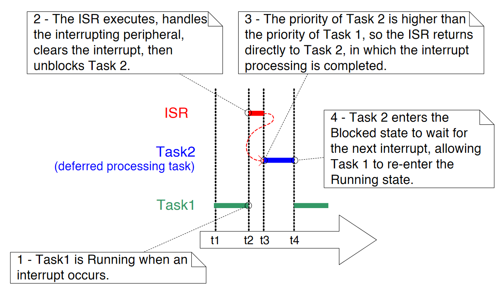

# 中断管理

## 章节介绍和范围

### 事件

嵌入式实时系统必须对源自环境的事件做出响应。例如，到达以太网外设的数据包（事件）可能需要传递到 TCP/IP 堆栈进行处理（操作）。非琐碎的系统必须服务于来自多个源的事件，所有这些源都有不同的处理开销和响应时间要求。在每种情况下，都必须对最佳事件处理实施策略作出判断：

1. 如何检测事件？通常使用中断，但也可以轮询输入。
2. 当使用中断时，中断服务程序（ISR）内部应执行多少处理，外部应执行多少处理？通常希望每个 ISR尽可能短。
3. 如何将事件与主（非 ISR）代码通信，以及如何构造此代码以最佳地适应潜在异步事件的处理？

FreeRTOS 不会对应用程序设计者强加任何特定的事件处理策略，但确实提供了允许以简单且可维护的方式实施所选策略的功能。

重要的是区分任务的优先级和中断的优先级：

* 任务是与运行 FreeRTOS 的硬件无关的软件功能。 应用程序编写者在软件中分配任务的优先级，软件算法（调度程序）决定哪个任务将处于运行状态。
* 尽管是用软件编写的，但中断服务程序是硬件特性，因为硬件控制将运行哪个中断服务程序以及何时运行。 任务只有在没有 ISR 运行时才会运行，所以最低优先级的中断会中断最高优先级的任务，任务没有办法抢占 ISR。

所有运行FreeRTOS的体系结构都能够处理中断，但有关中断条目和中断优先级分配的细节因体系结构而异。

### 范围

本章旨在让读者更好地理解：

* 哪些 FreeRTOS API 函数可以在中断服务程序中使用。
* 将中断处理推迟到任务的方法。
* 如何创建和使用二进制信号量和计数信号量。
* 二进制和计数信号量之间的区别。
* 如何使用队列将数据传入和传出中断服务程序。
* 一些 FreeRTOS 移植时可用的中断嵌套模型。

## 从 ISR 使用 FreeRTOS API

### 中断安全 API

通常需要使用来自中断服务函数 \(ISR\) 的 FreeRTOS API 函数提供的功能，但许多 FreeRTOS API 函数执行在 ISR 内无效的操作——其中最值得注意的是放置调用 API函数进入Blocked状态； 如果从 ISR 调用 API 函数，则它不是从任务调用的，因此没有调用任务可以置于阻塞状态。 FreeRTOS 通过提供一些 API 函数的两个版本来解决这个问题； 一种用于任务的版本，一种用于 ISR 的版本。 旨在从 ISR 使用的函数在其名称后加上“FromISR”。

> 注意：切勿从 ISR 调用名称中不含“FromISR”的 FreeRTOS API 函数。

### 使用单独的中断安全 API 的好处

具有用于中断的单独 API 可以使任务代码更高效，ISR 代码更有效，并且中断输入更简单。 要了解为什么，考虑另一种解决方案，它将提供一个API函数的单一版本，可以从一个任务和一个ISR调用。如果可以从任务和ISR调用相同版本的API函数，则：

* API 函数需要额外的逻辑来确定它们是从任务还是从 ISR 调用的。 额外的逻辑会在函数中引入新的路径，使函数变得更长、更复杂、更难测试。
* 当从任务调用函数时，某些 API 函数参数将过时，而当从 ISR 调用函数时，其他函数参数将过时。
* 每个 FreeRTOS 移植都需要提供一种机制来确定执行上下文（任务或 ISR）。
* 难以确定执行上下文（任务或 ISR）的架构将需要额外的、浪费的、使用更复杂的非标准中断入口代码，允许软件提供执行上下文。

### 使用单独的中断安全 API 的缺点

拥有两个版本的某些 API 函数可以提高任务和 ISR 的效率，但会带来新的问题；有时需要从任务和 ISR 调用不属于 FreeRTOS API 的函数，但需要使用 FreeRTOS API。

这通常只有在集成第三方代码时才会出现问题，因为这是软件设计不受应用程序编写者控制的唯一时候。 如果这确实成为一个问题，那么可以使用以下技术之一来克服该问题：

1. 将中断处理推迟到任务，因此 API 函数只能从任务的上下文中调用。
2. 如果您使用的是支持中断嵌套的 FreeRTOS 移植，则使用以 “FromISR” 结尾的 API 函数版本，因为该版本可以从任务和 ISR 中调用（反之则不然，不以 “FromISR” 结尾的 API 函数 不能从 ISR 调用“FromISR”）。
3. 第三方代码通常包括一个 RTOS 抽象层，可以实现该抽象层来测试调用函数的上下文（任务或中断），然后调用适合该上下文的 API 函数。

### xHigherPriorityTaskWoken 参数

本节介绍了 `xHigherPriorityTaskWoken` 参数的概念。 如果您尚未完全理解本节，请不要担心，因为以下部分提供实际示例。

如果上下文切换是由中断执行的，那么中断退出时运行的任务可能与进入中断时运行的任务不同——中断将中断一个任务，但返回到另一个任务。

一些 FreeRTOS API 函数可以将任务从阻塞状态移动到就绪状态。 这已经在诸如 `xQueueSendToBack()` 之类的函数中看到了，如果有一个任务在阻塞状态等待数据在主题队列上可用，它将解除对任务的阻塞。

如果被 FreeRTOS API 函数解除阻塞的任务的优先级高于处于运行状态的任务的优先级，那么根据 FreeRTOS 调度策略，应该切换到更高优先级的任务。 实际切换到更高优先级任务的时间取决于调用 API 函数的上下文：

* 如果从任务中调用 API 函数

如果在 `FreeRTOSConfig.h` 中将 `configUSE_PREEMPTION` 设置为 `1`，那么在 API 函数中会自动切换到更高优先级的任务——所以在 API 函数退出之前。 这已经在图 43 中看到，其中写入定时器命令队列导致在写入命令队列的函数退出之前切换到 RTOS 守护程序任务。

* 如果从中断调用 API 函数

中断内不会自动切换到更高优先级的任务。 相反，设置了一个变量来通知应用程序编写者应该执行上下文切换。 中断安全 API 函数（以 “FromISR” 结尾的函数）有一个名为 `pxHigherPriorityTaskWoken` 的指针参数，用于此目的。

如果应该执行上下文切换，则中断安全 API 函数会将 `*pxHigherPriorityTaskWoken` 设置为 `pdTRUE`。 为了能够检测到这种情况，`pxHigherPriorityTaskWoken` 指向的变量在第一次使用之前必须初始化为 `pdFALSE`。

如果应用程序编写者选择不从 ISR 请求上下文切换，则更高优先级的任务将保持就绪状态，直到调度程序下次运行——在最坏的情况下将在下一次滴答中断期间。

FreeRTOS API 函数只能将 `*pxHighPriorityTaskWoken` 设置为 `pdTRUE`。 如果一个 ISR 调用了多个 FreeRTOS API 函数，那么可以在每个 API 函数调用中传递相同的变量作为 `pxHigherPriorityTaskWoken` 参数，并且该变量只需要在第一次使用之前初始化为 `pdFALSE`。

在 API 函数的中断安全版本中，上下文切换不会自动发生有几个原因：

1. 避免不必要的上下文切换：在任务需要执行任何处理之前，中断可能会执行多次。 例如，考虑一个任务处理一个由中断驱动的 UART 接收到的字符串的场景； 每次接收到一个字符时，UART ISR 都切换到任务是一种浪费，因为任务只有在接收到完整字符串后才能执行。
2. 控制执行序列：中断可能偶尔发生，而且时间不可预测。 专业的 FreeRTOS 用户可能希望暂时避免在其应用程序的特定点不可预测地切换到不同的任务——尽管这也可以使用 FreeRTOS 调度程序锁定机制来实现。
3. 可移植性：它是可以跨所有 FreeRTOS 移植使用的最简单的机制。
4. 效率：面向较小处理器架构的端口仅允许在 ISR 的最后请求上下文切换，而消除该限制将需要额外且更复杂的代码。 它还允许在同一 ISR 内多次调用 FreeRTOS API 函数，而不会在同一 ISR 内生成多个上下文切换请求。
5. 在 RTOS 滴答定时中断执行：正如本书后面将看到的，可以将应用程序代码添加到 RTOS 滴答中断中。 尝试在滴答中断内进行上下文切换的结果取决于正在使用的 FreeRTOS 移植。 充其量，它会导致对调度程序的不必要调用。

使用 `pxHigherPriorityTaskWoken` 参数是可选的。 如果不需要，则将 `pxHigherPriorityTaskWoken` 设置为 `NULL`。

### portYIELD\_FROM\_ISR\(\) 和 portEND\_SWITCHING\_ISR\(\) 宏

本节介绍用于从 ISR 请求上下文切换的宏。 如果您尚未完全理解本节，请不要担心，因为以下部分提供实际示例。

`taskYIELD()` 是一个宏，可以在任务中调用以请求上下文切换。 `portYIELD_FROM_ISR()` 和 `portEND_SWITCHING_ISR()` 都是 `taskYIELD()` 的中断安全版本。 `portYIELD_FROM_ISR()` 和 `portEND_SWITCHING_ISR()` 都以同样的方式使用，并且做同样的事情。 某些 FreeRTOS 移植仅提供两个宏之一。 较新的 FreeRTOS 移植提供这两种宏。本书中的示例使用 `portYIELD_FROM_ISR()`。

```c
portEND_SWITCHING_ISR( xHigherPriorityTaskWoken );
```

清单 87. `portEND_SWITCHING_ISR()` 宏 

```c
portYIELD_FROM_ISR( xHigherPriorityTaskWoken );
```

清单 88. `portYIELD_FROM_ISR()` 宏

从中断安全 API 函数传出的 `xHigherPriorityTaskWoken` 参数可以直接用作调用 `portYIELD_FROM_ISR()`中的参数。

如果 `portYIELD_FROM_ISR()` `xHigherPriorityTaskWoken` 参数是 `pdFALSE`（`0`），则不请求上下文切换，并且宏不起作用。 如果 `portYIELD_FROM_ISR()` `xHigherPriorityTaskWoken` 参数不是 `pdFALSE`，则请求上下文切换，并且处于 Running 状态的任务可能会更改。 中断将始终返回到处于运行状态的任务，即使在中断执行期间处于运行状态的任务发生了变化。

大多数 FreeRTOS 移植允许在 ISR 内的任何位置调用 `portYIELD_FROM_ISR()`。 一些 FreeRTOS 移植（主要用于较小架构的端口）仅允许在 ISR 的最后调用 `portYIELD_FROM_ISR()`。

## 延迟中断处理

保持 ISR 尽可能短通常被认为是最佳实践。 原因包括：

* 即使任务已被分配非常高的优先级，如果硬件不提供中断，则它们只会运行。
* ISR 可以中断（添加“抖动”）任务的开始时间和执行时间。
* 根据运行 FreeRTOS 的架构，在执行 ISR 时可能无法接受任何新中断，或至少是新中断的子集。
* 应用程序编写者需要考虑并防范任务和 ISR 同时访问变量、外设和内存缓冲区等资源的后果。
* 一些 FreeRTOS 移植允许中断嵌套，但中断嵌套会增加复杂性并降低可预测性。中断越短，嵌套的可能性就越小。

中断服务程序必须记录中断的原因，并清除中断。 中断所需的任何其他处理通常可以在任务中执行，从而允许中断服务程序尽可能快地退出。这称为“延迟中断处理”，因为中断所需的处理从“延迟”开始。 任务的 ISR。

将中断处理推迟到任务还允许应用程序编写者优先处理相对于应用程序中其他任务的处理，并使用所有 FreeRTOS API 函数。

如果中断处理的任务的优先级高于任何其他任务的优先级，则处理将立即执行，就像处理已在 ISR 本身中执行一样。 这种情况如图 48 所示，其中任务 1 是一个正常的应用程序任务，任务 2 是中断处理被推迟到的任务。



在图 48 中，中断处理从时间 t2 开始，实际上在时间 t4 结束，但只有时间 t2 和 t3 之间的时间段用于 ISR。 如果未使用延迟中断处理，则时间 t2 和 t4 之间的整个时间段都将花费在 ISR 中。

关于何时最好执行 ISR 中的中断所需的所有处理以及何时最好将部分处理推迟到任务，没有绝对的规则。 在以下情况下将处理推迟到任务最有用：

* 中断所需的处理并非微不足道。 例如，如果中断只是存储模数转换的结果，那么几乎可以肯定这最好在 ISR 内部执行，但如果转换结果还必须通过软件过滤器，那么它可能是最好在任务中执行过滤器。
* 中断处理可以方便地执行 ISR 内部无法执行的操作，例如写入控制台或分配内存。
* 中断处理不是确定性的——这意味着事先不知道处理需要多长时间。

以下各节描述并演示了本章到目前为止介绍的概念，包括可用于实现延迟中断处理的 FreeRTOS 功能。

## 用于同步的二进制信号量


